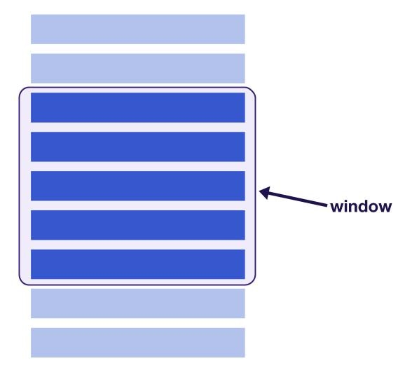
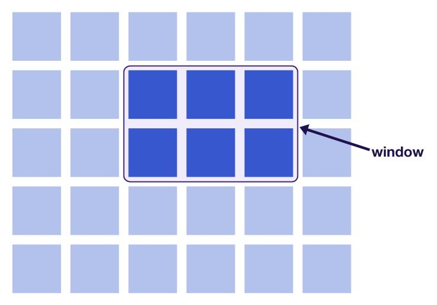
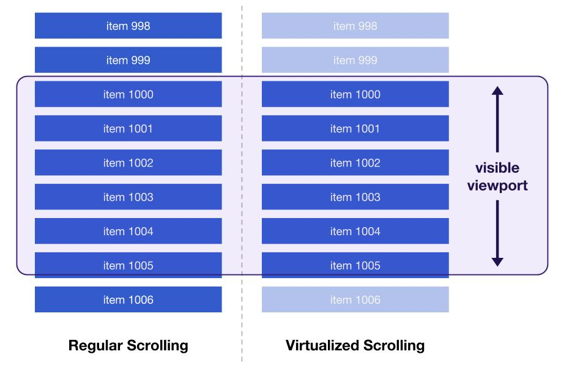

# بهینه‌سازی نمایش لیست‌های بسیار بزرگ با استفاده از `react-window`

لایبرری `react-window` کمک میکنه لیست های بزرگ و طولانی به طور بهینه رندر بشوند

 به جای بارگذاری و نمایش تمامی آیتم‌های یک لیست بزرگ به طور همزمان، تنها آیتم‌هایی که قرار است در محدوده دید کاربر باشند، بارگذاری و نمایش داده می‌شوند. این کار به بهبود عملکرد و کارایی صفحات وب کمک شایانی می‌کند، به ویژه زمانی که با لیست‌های حاوی هزاران یا حتی میلیون‌ها آیتم سروکار داریم.

ممکن است زمان‌هایی وجود داشته باشد که نیاز دارید یک جدول بزرگ یا لیستی که شامل تعداد زیادی ردیف است را نمایش دهید. بارگذاری هر آیتم در چنین لیستی می‌تواند به طور قابل توجهی بر عملکرد تأثیر بگذارد.

مجازی‌سازی لیست، یا "پنجره‌سازی"، مفهومی است که فقط آنچه برای کاربر قابل مشاهده است را رندر می‌کند. تعداد عناصری که در ابتدا رندر می‌شوند، یک زیرمجموعه بسیار کوچک از کل لیست است و "پنجره" محتوای قابل مشاهده هنگامی که کاربر ادامه به اسکرول دادن می‌دهد، حرکت می‌کند. این، هم عملکرد رندر و هم عملکرد اسکرول لیست را بهبود می‌بخشد.



نودها DOM که از “window خارج می‌شوند، بازیافت می‌شوند یا اینکه فوری با عناصر جدیدتر هنگامی که کاربر در لیست پایین می‌رود جایگزین می‌شوند. این کار تعداد کل عناصر رندر شده را مختص به اندازه پنجره نگه می‌دارد.

## react-window

<div dir="rtl">
کتابخانه `react-window` یک کتابخانه کوچک است که ایجاد لیست‌های مجازی‌سازی شده در برنامه را آسان‌تر می‌کند. این کتابخانه تعدادی API پایه را ارائه می‌دهد که می‌توان از آن‌ها برای انواع مختلفی از لیست‌ها و جداول استفاده کرد.
</div>


#### از fixed size lists (لیست با طول ثابت) در چه زمانی استفاده کنیم؟

اگر لیست طولانی و یک‌بعدی از آیتم‌هایی با اندازه یکسان دارید، از کامپوننت `FixedSizeList` استفاده کنید.

```js
import React from 'react';
import { FixedSizeList } from 'react-window';

const items = [...] // some list of items

const Row = ({ index, style }) => (
  <div style={style}>
     {/* define the row component using items[index] */}
  </div>
);

const ListComponent = () => (
  <FixedSizeList
    height={500}
    width={500}
    itemSize={120}
    itemCount={items.length}
  >
    {Row}
  </FixedSizeList>
);

export default ListComponent;
```


<div dir="rtl">
 
 1. کامپوننت `FixedSizeList` از پراپرتی‌های `height`، `width` و `itemSize` برای کنترل اندازه آیتم‌ها درون لیست استفاده می‌کند.
 
 2. تابعی که ردیف‌ها را رندر می‌کند به عنوان فرزند به `FixedSizeList` داده می‌شود. جزئیات مربوط به آیتم خاصی می‌تواند با استفاده از آرگومان `index` (items[index]) دسترسی پیدا کند.
 
 3. پارامتر `style` نیز به روش رندر کردن ردیف ارسال می‌شود که باید به عنصر ردیف متصل شود. آیتم‌های لیست با استفاده از موقعیت‌دهی مطلق و با اختصاص دادن مقادیر ارتفاع و عرض به صورت اینلاین قرار داده می‌شوند، و پارامتر `style` برای این مسئول است.
</div>


###### نکته مهم

هشدار: از اختصاص دادن ویژگی‌های ارتفاع و عرض به لیست یا آیتم لیست با استفاده از فایل CSS خارجی خودداری کنید. این ویژگی‌ها به دلیل اعمال شدن ویژگی‌های استایل به صورت اینلاین، نادیده گرفته می‌شوند.

#### زمان استفاده از لیست‌های با اندازه متغیر

از کامپوننت `VariableSizeList` برای رندر کردن یک لیست از آیتم‌هایی که اندازه‌های مختلفی دارند استفاده کنید. این کامپوننت به همان شیوه‌ای که یک لیست با اندازه ثابت کار می‌کند عمل می‌کند، اما به جای یک مقدار خاص، انتظار دارد تابعی برای پراپرتی `itemSize` داده شود.

```js
import React from 'react';
import { VariableSizeList } from 'react-window';

const items = [...] // some list of items

const Row = ({ index, style }) => (
  <div style={style}>
     {/* define the row component using items[index] */}
  </div>
);

const getItemSize = index => {
  // return a size for items[index]
}

const ListComponent = () => (
  <VariableSizeList
    height={500}
    width={500}
    itemCount={items.length}
    itemSize={getItemSize}
  >
    {Row}
  </VariableSizeList>
);

export default ListComponent;
```

نمایش خروجی: (<https://react-window-variable.glitch.me>)

تابع اندازه آیتمی که به پراپرتی `itemSize` داده می‌شود، در این مثال ارتفاع ردیف‌ها را به صورت تصادفی تعیین می‌کند. با این حال، در یک برنامه واقعی، باید منطق واقعی‌ای برای تعیین اندازه‌های هر آیتم وجود داشته باشد. به طور ایده‌آل، این اندازه‌ها باید بر اساس داده‌ها محاسبه شوند یا از یک API دریافت شوند.

توجه: هر دو کامپوننت `FixedSizeList` و `VariableSizeList` با استفاده از پراپ `layout="horizontal"` پشتیبانی از لیست‌های افقی را دارند. برای دیدن یک مثال، نگاهی به داکیومنت بیندازید.
[داکیومنت](https://react-window.vercel.app/#/examples/list/fixed-size)

## Grids

کتابخانه `react-window` همچنین پشتیبانی از مجازی‌سازی لیست‌های چندبعدی یا گریدها را فراهم می‌کند. در این زمینه، "پنجره" محتوای قابل مشاهده با اسکرول کردن کاربر به صورت افقی و عمودی تغییر می‌کند.



به همین ترتیب، هر دو کامپوننت `FixedSizeGrid` و `VariableSizeGrid` می‌توانند بسته به اینکه آیا اندازه آیتم‌های خاص لیست می‌تواند متغیر باشد، استفاده شوند.

1. برای `FixedSizeGrid`، API تقریباً مشابه است اما با این واقعیت که ارتفاع‌ها، عرض‌ها، و تعداد آیتم‌ها باید برای هر دو ستون‌ها و ردیف‌ها نمایش داده شوند.
2. برای `VariableSizeGrid`، هم عرض ستون‌ها و هم ارتفاع ردیف‌ها می‌توانند با ارسال توابع به جای مقادیر به پراپرتی‌های مربوطه تغییر کنند.

[داکیومنت برای  virtualized grids](https://react-window.vercel.app/#/examples/grid/fixed-size)

توجه: علاوه بر فراهم کردن کامپوننت‌های پایه برای ایجاد لیست‌ها و گریدهای کارآمد، `react-window` توانایی‌های دیگری مانند اسکرول کردن به یک آیتم خاص یا فراهم کردن یک نشانگر زمانی که کاربر در حال اسکرول است را نیز ارائه می‌دهد. مستندات مثال‌هایی برای این موارد فراهم می‌کند.

## لودینگ به صورت Lazy موقع اسکرول

بسیاری از وب‌سایت‌ها عملکرد را با انتظار برای بارگذاری و رندر کردن آیتم‌ها در یک لیست طولانی تا زمانی که کاربر پایین‌تر اسکرول کند، بهبود می‌بخشند. این تکنیک که معمولاً به عنوان "بارگذاری نامحدود" شناخته می‌شود، گره‌های DOM جدیدی را به لیست اضافه می‌کند زمانی که کاربر از یک آستانه خاص نزدیک به انتها عبور می‌کند. اگرچه این روش بهتر از بارگذاری همه آیتم‌ها در یک لیست به طور همزمان است، اما اگر کاربر از تعداد زیادی از آن‌ها عبور کرده باشد، در نهایت باعث پر شدن DOM با هزاران ردیف می‌شود. این می‌تواند منجر به اندازه DOM بیش از حد بزرگ شود، که شروع به تأثیرگذاری بر عملکرد با کند کردن محاسبات سبک و تغییرات DOM می‌کند.



بهترین روش برای حل این مشکل استفاده مداوم از یک کتابخانه مانند `react-window` برای حفظ یک "پنجره" کوچک از عناصر در یک صفحه است، اما همچنین باید ورودی‌های جدیدتر را همانطور که کاربر به پایین اسکرول می‌کند، به صورت تنبل بارگذاری کند. یک بسته جداگانه، `react-window-infinite-loader`، این امکان را با `react-window` میسر می‌سازد.

مثال استیت در کامپوننت والد مدیریت شده

```js
import React, { Component } from 'react';

import ListComponent from './ListComponent';

class App extends Component {
  constructor(props) {
    super(props);
    this.state = {
      items: [], // instantiate initial list here
      moreItemsLoading: false,
      hasNextPage: true
    };

    this.loadMore = this.loadMore.bind(this);
  }

  loadMore() {
   // method to fetch newer entries for the list
  }

  render() {
    const { items, moreItemsLoading, hasNextPage } = this.state;

    return (
      <ListComponent
        items={items}
        moreItemsLoading={moreItemsLoading}
        loadMore={this.loadMore}
        hasNextPage={hasNextPage}
      />
    );
  }
}

export default App;
```

یک متد `loadMore` به یک کامپوننت فرزند `ListComponent` که لیست بارگذاری نامحدود را شامل می‌شود، منتقل می‌شود. این موضوع مهم است زیرا بارگذار نامحدود نیاز دارد تا یک کال‌بک (callback) را برای بارگذاری موارد بیشتر زمانی که کاربر از یک نقطه خاصی اسکرول کرده است، فعال کند.

مثال  `ListComponent` یک لیست رو رندر کنه

```js
import React from 'react';
import { FixedSizeList } from 'react-window';
import InfiniteLoader from "react-window-infinite-loader";

const ListComponent = ({ items, moreItemsLoading, loadMore, hasNextPage }) => {
  const Row = ({ index, style }) => (
     {/* define the row component using items[index] */}
  );

  const itemCount = hasNextPage ? items.length + 1 : items.length;

  return (
    <InfiniteLoader
      isItemLoaded={index => index < items.length}
      itemCount={itemCount}
      loadMoreItems={loadMore}
    >
      {({ onItemsRendered, ref }) => (
        <FixedSizeList
          height={500}
          width={500}
          itemCount={itemCount}
          itemSize={120}
          onItemsRendered={onItemsRendered}
          ref={ref}
        >
          {Row}
        </FixedSizeList>
      )}
  </InfiniteLoader>
  )
};

export default ListComponent;
```

<div dir="rtl">
در اینجا، کامپوننت `FixedSizeList` درون `InfiniteLoader` قرار داده شده است. پراپرتی‌هایی که به بارگذار تخصیص داده شده‌اند عبارتند از:

1. `isItemLoaded`: متدی که بررسی می‌کند آیا آیتم خاصی بارگذاری شده است
2. `itemCount`: تعداد آیتم‌ها در لیست (یا تعداد مورد انتظار)
3. `loadMoreItems`: کال‌بکی که یک پرامیس برمی‌گرداند که به داده‌های اضافی برای لیست منجر می‌شود

</div>

یک پراپ رندر (render prop) استفاده می‌شود تا تابعی برگردانده شود که کامپوننت لیست برای رندر کردن استفاده می‌کند. هم `onItemsRendered` و هم ویژگی‌های `ref` ویژگی‌هایی هستند که باید منتقل شوند.

[نمونه خروجی برای infinite loading روی لیست مجازی سازی شده](https://react-window-infinite.glitch.me)

اسکرول کردن به پایین لیست ممکن است احساس مشابهی داشته باشد، اما هر بار که به نزدیکی انتهای لیست اسکرول می‌کنید، یک درخواست برای بازیابی 10 کاربر از یک API کاربر تصادفی ارسال می‌شود. این کار همگی در حالی انجام می‌شود که تنها یک "پنجره" واحد از نتایج در هر زمان رندر می‌شود.

با بررسی ایندکس یک آیتم خاص، یک وضعیت بارگذاری متفاوت می‌تواند برای آیتم نشان داده شود، بسته به اینکه آیا یک درخواست برای ورودی‌های جدیدتر ارسال شده است و آیتم هنوز در حال بارگذاری است.

مثال:

```js
const Row = ({ index, style }) => {
  const itemLoading = index === items.length;

  if (itemLoading) {
      // return loading state
  } else {
      // return item
  }
};
```

## Overscanning

از آنجایی که آیتم‌ها در یک لیست مجازی‌سازی شده تنها زمانی تغییر می‌کنند که کاربر اسکرول می‌کند، فضای خالی می‌تواند به طور مختصر نمایان شود در حالی که ورودی‌های جدیدتر قرار است نمایش داده شوند. شما می‌توانید با اسکرول سریع هر یک از مثال‌های قبلی در این راهنما این موضوع را متوجه شوید.

برای بهبود تجربه کاربری لیست‌های مجازی‌سازی شده، `react-window` به شما اجازه می‌دهد تا با استفاده از ویژگی `overscanCount`، آیتم‌ها را بیش از حد اسکن کنید. این به شما امکان می‌دهد تعدادی از آیتم‌ها را خارج از "پنجره" قابل مشاهده تعریف کنید تا در همه زمان‌ها رندر شوند.

```js
<FixedSizeList
  //...
  overscanCount={4}
>
  {...}
</FixedSizeList>
```

<div dir="rtl">
`overscanCount` هم برای کامپوننت‌های `FixedSizeList` و `VariableSizeList` کار می‌کند و یک مقدار پیش‌فرض برابر با 1 دارد. بسته به اینکه یک لیست چقدر بزرگ است و همچنین اندازه هر آیتم، اسکن بیشتر از فقط یک ورودی می‌تواند به جلوگیری از نمایش محسوس فضای خالی هنگام اسکرول کردن کاربر کمک کند. با این حال، اسکن بیش از حد تعداد زیادی از ورودی‌ها می‌تواند بر عملکرد به طور منفی تأثیر بگذارد. نکته اصلی استفاده از یک لیست مجازی‌سازی شده، کاهش تعداد ورودی‌ها به آنچه که کاربر در هر لحظه می‌تواند ببیند است، پس سعی کنید تعداد آیتم‌های اسکن بیش از حد را تا حد امکان پایین نگه دارید.

</div>


برای `FixedSizeGrid` و `VariableSizeGrid`، از ویژگی‌های `overscanColumnsCount` و `overscanRowsCount` برای کنترل تعداد ستون‌ها و ردیف‌ها برای اسکن بیش از حد به ترتیب استفاده کنید.

##### نتیجه کلی

اگر مطمئن نیستید از کجا شروع به مجازی‌سازی لیست‌ها و جداول در برنامه خود کنید، این مراحل را دنبال کنید:

1. عملکرد رندر و اسکرول را اندازه‌گیری کنید. این مقاله نشان می‌دهد که چگونه می‌توان از نمایشگر FPS در ابزارهای توسعه‌دهنده Chrome برای بررسی کارایی رندر شدن آیتم‌ها در یک لیست استفاده کرد.
2. برای هر لیست طولانی یا گریدی که بر عملکرد تأثیر می‌گذارد، `react-window` را شامل کنید.
3. اگر ویژگی‌های خاصی وجود دارد که در `react-window` پشتیبانی نمی‌شوند، در صورتی که نمی‌توانید خودتان این قابلیت را اضافه کنید، استفاده از `react-virtualized` را در نظر بگیرید.
5. اگر نیاز به بارگذاری تنبل آیتم‌ها همانطور که کاربر اسکرول می‌کند دارید، لیست مجازی‌سازی شده خود را با `react-window-infinite-loader` بپوشانید.
6. برای لیست‌های خود از ویژگی `overscanCount` و برای گریدهای خود از ویژگی‌های `overscanColumnsCount` و `overscanRowsCount` استفاده کنید تا از نمایش فضای خالی جلوگیری کنید. بیش از حد ورودی‌ها را اسکن نکنید زیرا این کار بر عملکرد به طور منفی تأثیر می‌گذارد.

[منبع](https://web.dev/articles/virtualize-long-lists-react-window)

# ویدیو

[منبع](https://www.youtube.com/watch?v=mPzPP7Qh9YM)

یک لایبرری دیگر برای مجازی سازی کردن
[TanStack Virtual](https://tanstack.com/virtual/latest)

در کامپوننت زیر اولین و دومین  پراپس خودمون اضافه کردیم
سومین پراپس مربوط هست به به لایبرری ویژوال که پاس داده شده به این کامپوننت

```ts
import { CSSProperties } from "react";

type ListItemProps = {
  name: string;
  index: number;
  virtualizeStyles: CSSProperties;
};

const ListItem = ({ name, index, virtualizeStyles }: ListItemProps) => {
  return (
    <div style={virtualizeStyles}>
      <li className="listItem">
        <div>
          <strong>Name {" -> "}</strong>
          <p>{name}</p>
        </div>
        <p>index: {index}</p>
      </li>
    </div>
  );
};
```

این `virtualizeStyles` یک سری استایل هستند

کد زیر یه ارایه ۵۵۰ خونه‌ای ساختیم که اسامی میوه‌ها رو از آرایه می‌گیره و در هر خونه این ارایه جدید قرار میده


```ts
const fruites = ["Apple", "Orange", "Kiwi", "Papaya", "Melone", "Berries", "Pear","Grapes"];

export const randomizedFruites = Array.from(
  { length: 550 },
  () => fruites[Math.floor(Math.random() * fruites.length)]
);
```


یه هوک داریم به نام `useVirtualizer` در این لایبرری

این هوک چند پراپس ضروری می‌گیره

<div dir="rtl">
1. اولین طول آرایه اصلی که می‌خوایم مجازی سازیش کنیم رو می‌گیره
 
2. دومین `getScrollElement` کانتینری هست که قراره اسکرول بخوره رف اون المنت رو ریترن میکنه و در اصل یک فانکشن هست

3. سومین `estimateSize` هم یک فانکشن هست وحداکثر سایزی که ایتم ما ممکنه داشته باشه منظور هاز سایز ارتفاع هست

4. چهارمین `overscan` هم پراپرتی ضروری بعدی هست که این مشخص کننده تعداد ایتم هایی که توی ویندو نیستن و بالا  و پایین  لیست هستن و می‌خوان با اسکرول کردن رندر بشن

نکته: `overscan` هر چی تعداش بیشتر باشه تایم `initial render` ما بیشتر میشه
</div>


```tsx
const wrapperRef = useRef<HTMLDivElement | null>(null);

const virtualizer = useVirtualizer({
    randomizedFruites.length,
    getScrollElement: () => wrapperRef.current,
    estimateSize: () => 100,
    overscan: 5,
  });

return (<div ref={wrapperRef}></div>);
```

این هوک یک سری پراپرتی داره توش  که مهمترینش `items` هامون هست که قراره ویرچوالایز بشن و ریترن بشن

اینجوری هم بشه دسترسی پیدا میکنیم


```tsx
  const items = virtualizer.getVirtualItems();
```

این ایتم هایی که ریترن شده ارایه ای از اسمای که داخل میوه ها داریم نیست
اینجا فقط ایندکسش رو بهمون میده
کاری که ما باید بکنیم اینه که ایندکسی که بهمون میده توی `randomizedFruites`
بذاریم و اون ایتم رو بگیریم
الان میتونیم ایتم ها رو در دام نمایش بدیم

کامپوننت `ListItem` سه تا پراپس میگرفت `index` `name` و `virtualizeStyles`

`virtualizeStyles`
یک سری استایل های پایه هست که این لایبرری بهشون احتیاج داره
`position: "absolute"`
باید باشه چون این کلا با `absolute` و `transform‍` داره کار می‌کنه
استایل ها در زیر مشخص است

این خیلی مهم هست 
`transform: "translateY(${item.start}px)"` 
اون `item.start` میشه نقطه شروع لیست


```tsx
 return (
    <div ref={parentRef}>
        {items.map((item) => (
          <ListItem
            virtualizeStyles={{
              position: "absolute",
              width: "100%",
              top: 0,
              left: 0,
              transform: `translateY(${item.start}px)`,
              height: item.size,
            }}
            index={item.index}
            name={randomizedUsers[item.index]}
            key={item.key}
          />
        ))}
    </div>
  );
```


در کد بالا یک `div`
دیگه نیاز داریم که میشه کانتینر ما میشه کانتینری که میاد به میزان لازم  یک ارتفاعی رو میگیره
 مثلا ۱۰۰۰ ایتم داشته باشیم باید بیاد دقیقا به اندازه اون ۱۰۰۰ ایتم ارتفاعی بگیره که اون هم خود لایبرری بهمون میده

ارتفاع کانتینر والد میشه 
`virtualizer.getTotalSize()`

به پرنت اصلی هم باید استایل داداندازه باید داشته باشه که اگر محتوا از ارتفاعش بیشتر بود بفهمونه به رپر که باید صفحه اسکرول بخوره

 ```tsx
 const wrapperStyles: CSSProperties = {
    width: 400,
    height: 400,
    overflowY: "auto",
    padding: "0 0.5rem",
  };

  const parentStyles: CSSProperties = {
    position: "relative",
    width: "100%",
    height: virtualizer.getTotalSize(),
  };
  
 return (
    <div ref={parentRef} style={wrapperStyles}>
      <div style={parentStyles}>
        {items.map((item) => (
          <ListItem
            virtualizeStyles={{
              position: "absolute",
              width: "100%",
              top: 0,
              left: 0,
              transform: `translateY(${item.start}px)`,
              height: item.size,
            }}
            index={item.index}
            name={randomizedUsers[item.index]}
            key={item.key}
          />
        ))}
      </div>
    </div>
  );
```
