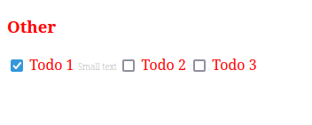
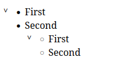

# Learn Web Components
## ساخت checkbox سفارشی

```javascript
// TodoItem.js
const template = document.createElement('template')
template.innerHTML = `
    <style>
        label {
            color: red;
            diplay: block;
        }

        .description {
            font-size: .65rem;
            font-weight: lighter;
            color: #777;
        }
    </style>
    
    <label>
        <input type="checkbox" />
        <slot></slot>
        <span class="description">
            <slot name="description"></slot>
        </span>
    </label>
`

class TodoItem extends HTMLElement {
    constructor() {
        super()
        const shadow = this.attachShadow({ mode: 'open' })
        shadow.append(template.content.cloneNode(true))
        this.checkbox = shadow.querySelector('input')
    }

    static get observedAttributes() {
        return ['checked']
    }

    // invoked when one of the custom element's attributes is added, removed, or changed
    attributeChangedCallback(name, oldValue, newValue) {
        if (name === 'checked') this.updateChecked(newValue)
    }

    updateChecked(value) {
        this.checkbox.checked = value != null && value !== 'false'
    }
}

customElements.define('todo-item', TodoItem)

const item = document.querySelector('todo-item')
let checked = true
setInterval(() => {
    checked = !checked
    item.setAttribute('checked', checked)
}, 500)
```
---
> The HTMLElement interface represents any HTML element. Some elements directly implement this interface, while others implement it via an interface that inherits it.

— [MDN](https://developer.mozilla.org/en-US/docs/Web/API/HTMLElement)

---
> The `<template>` tag in HTML is used to store the HTML code fragments, which can be cloned and inserted in an HTML document. The content of the tag is hidden from clients being stored on the client-side. It is inserted until activated using JavaScript. Use JavaScript to get the content from a template, and add it to the web page.

— [geeksforgeeks](https://www.geeksforgeeks.org/html-template-tag/)

---
> The slot is the element part of the web component technology which is a placeholder inside a component that you simply can fill together with your own markup, which allows you to make separate DOM trees and represent them together.

— [geeksforgeeks](https://www.geeksforgeeks.org/html-slot-tag/)

---
> Shadow DOM serves for encapsulation. It allows a component to have its very own “shadow” DOM tree, that can’t be accidentally accessed from the main document, may have local style rules, and more.

— [javascript.info](https://javascript.info/shadow-dom)

---
> attributeChangedCallback: Invoked each time one of the custom element's attributes is added, removed, or changed. Which attributes to notice change for is specified in a static get observedAttributes method

— [MDN](https://developer.mozilla.org/en-US/docs/Web/Web_Components/Using_custom_elements#using_the_lifecycle_callbacks)

```html
<!-- index.html -->
<head>
    ...
    <style>
        h3 {
            color: red;
        }
    </style>
</head>
<body>
    <h3>Other</h3>
    <todo-item checked
        >Todo 1
        <span slot="description">Small text</span>
    </todo-item>
    <todo-item>Todo 2</todo-item>
    <todo-item>Todo 3</todo-item>
</body>
```



# ساخت expandable element سفارشی

```javascript
// expandableList.js
class ExpandableList extends HTMLUListElement {
    constructor() {
        super()
        this.style.position = 'relative'
        this.toggleBtn = document.createElement('button')
        this.toggleBtn.style.position = 'absolute'
        this.toggleBtn.style.border = 'none'
        this.toggleBtn.style.background = 'none'
        this.toggleBtn.style.padding = 0
        this.toggleBtn.style.top = 0
        this.toggleBtn.style.left = '5px'
        this.toggleBtn.style.cursor = 'pointer'
        this.toggleBtn.innerText = '>'
        this.toggleBtn.addEventListener('click', () => {
            this.dataset.expanded = !this.isExpanded
        })
        this.appendChild(this.toggleBtn)
    }

    get isExpanded() {
        return (
            this.dataset.expanded !== 'false' && this.dataset.expanded != null
        )
    }

    static get observedAttributes() {
        return ['data-expanded']
    }

    attributeChangedCallback(name, oldValue, newValue) {
        this.updateStyles()
    }

    connectedCallback() {
        this.updateStyles()
    }

    updateStyles() {
        const transform = this.isExpanded ? 'rotate(90deg)' : ''
        this.toggleBtn.style.transform = transform
        ;[...this.children].forEach((child) => {
            if (child !== this.toggleBtn) {
                child.style.display = this.isExpanded ? '' : 'none'
            }
        })
    }
}

customElements.define('expandable-list', ExpandableList, { extends: 'ul' })

```
---
> The `HTMLUListElement` interface provides special properties (beyond those defined on the regular `HTMLElement` interface it also has available to it by inheritance) for manipulating unordered list (`<ul>`) elements.

— [MDN](https://developer.mozilla.org/en-US/docs/Web/API/HTMLUListElement)


```html
<!-- index.html -->
<head>
    ...
    <style>
        h3 {
            color: red;
        }
    </style>
</head>
<body>
    <h3>Other</h3>
        <ul is="expandable-list" data-expanded>
            <li>First</li>
            <li>Second</li>
            <ul is="expandable-list" data-expanded>
                <li>First</li>
                <li>Second</li>
            </ul>
        </ul>
</body>
```

