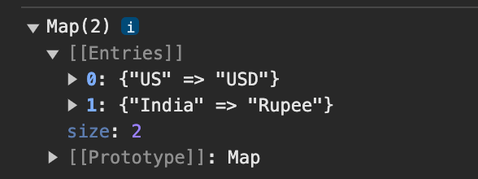
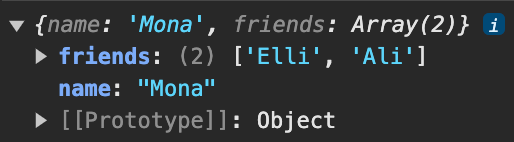

# Advanced-js

destructuring:

با این روش به پراپرتی ها و ایتم های مختلف داخل آرایه و آبجکت می توان دسترس داشت

در آرایه ها:

```js
const testArr = [1,2,3,4,5,6]
const first = testArr[0]
const first = testArr[1]
```

این روشی هست که معمولا دیتای یه ارایه رو می‌خونیم

نحوه `destructure` کردن آرایه

```js
const [first, second] = testArr
```

پروسه مثل ساختن یک متغیر معمولی هست و با قراردادن کروشه ها  در کنار `const`
به جاوا اسکریپت می‌فهمونیم که قراره `destructure` کنیم آرایه مد نظر رو

نیازی نیست که همه خانه های ارایه رو در `destructure` بیاریم کافیه اون خانه از ارایه رو خالی بذاریم (بع این معنی که اسکیپ می‌کنیمش)
اگر خانه ای از آرایه رو `destructure` کنیم که وجود نداره بهمون `undefined` بر می‌گردونه

```js
const [first, second, ,fourth] = testArr
```

## maps

در آبجکت کلیدی داریم که که مقدار مشخصی خواهد داشت
در این مثال ابجکتی داریم که لیستی از مقادیر نامرتبط هست اسم کشور و واجد پول هر کشور

```js
const Currency_Map = {
  "united states": "USD",
  India: "Rupee"
}
```

برای دسترسی به یک مقدار

```js
const currency = Currency_Map["India"]
```

از این روش استفاده میکنیم

حال یک ارایه داریم

```js
const currencies = [{
  name: "US",
  value:"USD"
},{
  name: "India",
  value: "Rupee"
}]
```

برای گرفتن مقدار باید

```js
const currency = currencies.find(c=> c.country === 'India').name
```

دو تا روش دقیقا یک کار انجام میدهند

آبجکتی داریم که همین کار را بهتر انجام می‌دهد

برای تبدیل به `map` روش زیر را طی می‌کنیم

```js
const map = new Map()
console.log(map) // یک مپ داریم که هیچ entries ندارد وخالی هست
```

به مپ باید آرایه ای از آرایه ها بدهیم
به هر آرایه یک `key` و `value` می‌دهیم

```js
const map = new Map([["US","USD"],["India", "Rupee"]])
```

مپ بالا حالا دو تا entry داره

بسیار شبیه به ابجکت هست خروجی مپ
ولی مپ نسبت به ابجکت تفاوت هایی داره که بسیار کاربرید هستند
اول اینکه key میتونه هر تایپی باشه حتی ابجکت

```js
const map = new Map([
  [{a:1}, 'USD'],
  ['India', 'Rupee'],
]);
```

تفاوت قابل مشاهده هست که در ابجکت کلید حتما تایپ استرینگ داره

```js
const user = {
  name: "Ali",
}

const map = new Map([
  [user, {age:20}],
]);
```

در این مثال دو ابجکت رو تجمیع کردیم
برای بررسی ولیو یک مپ

```js
const user = {
  name: "Ali",
}

const map = new Map([
  [user, {age:20}],
]);

console.log(map.get(user)) //output: {age: 20}
```

تفاوت های ابجکت و مپ

```js
const map = new Map([
  [1, "A"],
  [2, "B"],
  [3, "C"],
  [4, "D"],
]);
```

در مپ ترتیب مقادیر همیشه همان ترتیبی هست که وارد مپ کردیم ولی آبجکت ترتیب خاصی نداره

روی مپ ها به راحتی میشه لوپ کرد

```js
const map.forEach((value, key) => console.log(value,key))
```

برای لوپ روی ابجکت

```js
const obj = {
  a: 1,
  b: 2
}

Object.entries(obj).forEach((value, key) => console.log(value,key))
```

نکته اینجاست که `Object.entries(obj)` به ما یک آرایه میده که می‌تونیم از `forEach` استفاده کنیم

برای چنین سناریو هایی مپ بهترین گزینه هست
یکی از خوبی های map این هست که میشه سایز اون رو چک کرد که در ابجکت ها امکان پذیر نیست

```js
 console.log(map.size)
```

مپ ها ها پرفورمنس بهتری هم دارند اضافه و حذف مقادیر بسیار راحتتر هست

**متود های مپ**
خواند مقادیر

```js
 map.get()
```

خواند مقادیر

```js
 map.get()
```

ست کردن مقدار جدید

```js
 map.set(5 , "E") //Key Value
```

بررسی اینکه مقداری در مپ وجود دارد یا خیر
خروجی true, false

```js
 map.has(10) //بررسی اینکه آیا مقداری برای کلید ۱۰ داریم در این مپ یا خیر
```

حذف مقدار

```js
 map.delete(1) // حذف مقدار کلید ۱ اگر موجود باشد
```

پاک کردن مپ
این متود محتوای مپ رو خالی میکنه به صورت کامل

```js
 map.clear() // حذف مقدار کلید ۱ اگر موجود باشد
```

## sets

ست ها اکستنشن هایی برای آرایه ها هستند

مثال:
میخوایم ببینیمی که عدد ۴ در لیست زیر موجود هست یا خیر
اگر موجود نیست به لیست اضافه کنه

```js
const uniqueList = [1,2,3,4,5,6]
const newNumber = 4;
if(!uniqueList.includes(newNumber)){
  uniqueList.add(newNumber)
}
```

ست ها  می‌توان آرایه هایی در نظر گرفته که گارانتی می‌کنند که همیشه  همه مقادیر داخلشون یونیک هست

نحوه ساخت ست

```js
const set = new Set()
```

```js
const set = new Set([1,2,3,4,4,4,4,4])
console.log(set) // output: Set(4) {1, 2, 3, 4} 
```

مشخص هست که همه ایتم های تکراری رو حذف خواهد کرد
نمیشه ایتم تکراری به ست اضافه کرد
همیشه مقادیر رو چک میکنه قبل اینکه مقداری به لیست اضافه کنه

```js
const set = new Set([1,2,3,4])
set.add(4)
console.log(set) // output: Set(4) {1, 2, 3, 4} 
```

```js
const set = new Set([1,2,3,4])
set.add(5)
console.log(set) // output: Set(5) {1, 2, 3, 4, 5} 
```

در ست ها به ایتم ها نمی‌توان با ایندکس دسترسی پیدا کرد
کاری که می‌تونیم بکنیم اینه که چک کنیم مقدار مد نظر در ست موجود هست یا خیر از `has` استفاده می‌کنیم

```js
const set = new Set([1,2,3,4])
console.log(set.has(2)) // output: true
```

برای اینکه هر مقدار داخل ست رو دسترسی پیدا کنیم از `forEach` میتونیم استفاده کنیم

```js
const set = new Set([1,2,3,4])
set.forEach((value) => {
  console.log(value)
})
```

چون ست لیست یونیکی هست با استفاده از `has` می‌تونیم بررسی کنیم که مقدار درش موجود هست یا خیر نیازی نیست بدونیم در کدام ایندکس قرار داره
در نتیجه می‌تونیم به راحتی یک مقدار رو از داخلش حذف کنیم

```js
const set = new Set([1,2,3,4])
set.delete(2)
console.log(set) // output: Set(3) {1, 3, 4} 
```

در ارایه یک مقدار خاصی رو بخوایم حذف کنیم کار سختی هست ست این کار رو خیلی راحت کرده
دو تا متود دیگه ست ها `clear` و `size` هست که از نامهاشون مشخص هست
اولی ست رو خالی میکنه به طور کامل  و متود سایز سایز ست رو نمایش میده

```js
function removeDups(arr){
  const set = new Set(arr) //remove all the duplicates
  //this is how we change this set to array and return it
  return [...set]
}
removeDups([1,2,3,4,5,4,2,3,4,2,4,6,8,6,])
```

## Generators And Iterators

جنریتور
دو دسته هست
generator function and generator
 **generator function**
برای ساختش جلوی کیورد funtion یک *  قرار می‌دیم
چندین مقدار این فانکشن جنریتور میتونه برگردونه
به جای  `return` از `yield` استفاده می‌کنیم

اولین مقدار بر می‌گردونه  و بعدش صبر می‌کنه تا بهش بگیم که مقدار بعدی رو بهمون بده که در مثال پایین بعد از 1 صبر میکنه تا بعد مقداری بعدی رو درخواست میده که 2 هست

```js
function* simpleGenerator(){ // میتونه پارامتر داشته باشه
  yield 1
  yield 2
  yield 3
}
```

فانکشن جنریتور رو کال کردیم و بهمون جنریتوری میده که شامل کد بالا هست
با کال کردنش کدی که داخل فانکشن هست رو کال نمیکنیم بلکه جنریتوری می‌سازیم که که با این کد پر شده

```js
const generator = simpleGenerator()
```

توجه با استفاده از arrow funtion ها نمیشه جنریتور ساخت

باید جنریتورمون رو استارت کنیم تا ران بشه

```js
console.log(generator.next()) //output: { value: 1, done: false }
```

مثال
یوزکیس جنریتور برای وقتی که می‌خوایم کاری انجام بدیم و منتظر باشیم برای مدتی  تا بعد بریم سراغ مرحله بعد
یک یوزکیس دیگه وقتی می‌خوایم `infinite loop` درست کنیم بدون فریز کردن کامپیوتر

لوپ بی نهایت هست ولی چون داخل جنریتور هست تا وقتی `next()` رو روی جنریتور صدا میزنیم ران میشه

```js
function* fibonacciGenerator(){
  let prevOne = 0;
  let prevTwo = 1;
  yield 0;
  yield 1;

  while(true){
    const result = prevOne + prevTwo
    yield result
    prevOne =  prevTwo
    prevTwo =  result
  }
}

const generator = fibonacciGenerator()

console.log(generator.next()) // {value: 0, done: false}
console.log(generator.next()) // {value: 1, done: false}
console.log(generator.next()) // {value: 1, done: false}
console.log(generator.next()) // {value: 2, done: false}
console.log(generator.next()) // {value: 3, done: false}
```

برای اینکه جنریتورمون رو ریست کنیم می‌تونیم جنریتور جدی بسازیم

```js
const generator2 = fibonacciGenerator()

console.log(generator2.next()) // {value: 0, done: false}
console.log(generator2.next()) // {value: 1, done: false}
console.log(generator2.next()) // {value: 1, done: false}
console.log(generator2.next()) // {value: 2, done: false}
console.log(generator2.next()) // {value: 3, done: false}
```

برای خارج شدن از جنریتور میشه

```js
console.log(generator.return()) // {value: 0, done: false}
```

## Object Getters And Setters

بخواهیم اسم و فامیل رو ترکیب کنیم  می‌توانیم یک فانکشن بسازیم
برای مشاهده خروجی فانشکن نیاز داریم که فانکشن کال کنیم

```js
const obj = {
  firstName: "Mona",
  lastName: "LA",
  fullName(){
    return `${this.firstName} ${this.lastName}`
  }
}
console.log(obj.fullName()) // Mona LA
```

چطور میشه به عنوان پارامتر `fullName` رو نمایش داده با استفاده از `getters` و `setters`

نکته: `getter` ها هیچ وقت پارامتری نباید داشته باشند

```js
const obj = {
  firstName: "Mona",
  lastName: "LA",
  get fullName(){
    return `${this.firstName} ${this.lastName}`
  }
}
console.log(obj.fullName) // Mona LA
```

در این مثال `fullName` مثل یک پارامتر هست اما در واقعیت  که فانکشن هست کال میشه و مقدار داخلش ریترن میشه

اما `**setter**` ها اجازه میدهند که مقداری را با استفاده از فانکشنی ست کنیم
فانکشن setter میتونه ورودی بگیره

```js
const obj = {
  firstName: "Mona",
  lastName: "LA",
  set fullName(value){
    [this.firstName, this.lastName] = value.split(' ')
  }
}
obj.fullName = "Ali Azimi"
```

در کد ها پراپرتی هایی ممکنه ببینیم که با _ شروع می‌شوند و این به معنی این هست که این `private property` هست

```js
const obj = {
  _username_: "Mona",
  get username(value){
    return this._username
  }
  set username(value){
    // Check Value before set the private property
    if(value.length > 3){
      this._username = value
    }
  }
}
console.log(obj.username) //Mona
obj.username = Ab // won't change username
```

به جای `_username` از `symbol` میشه استفاده کرد

## bind

```js
window.name = "Global name" // set a name variable to window global obj

const obj = {
  name: "Mona",
}

function printName(){
  console.log(this.name) 
}

printName() // Global name
```

فانکشن `bind` کمک میکنه که کیورد `this` رو بتونیم تغییر بدیم به چیزی که مد نظرمونه اشاره کنه

همه فانکشن ها در js این فانکشن `bind` رو دارن

```js
const obj = {
  name: "Mona",
}

function printName(){
  console.log(this.name) 
}

const newPrintName = printName.bind(obj) // با این کار فانکشن جدید ایجاد میکنیم به نام newPrintName
newPrintName()
```

اگر `printName.bind(window)` چیزی تغییر نمی‌کنه چون پیش فرض همین هست

مثال

```js
function sum(a,b){
  return a + b
}

const sumTwo = sum.bind(null , 2) //there is no this keyword because we pass null
```

چون از `this` در فانکشن `sum` استفاده نشده می‌تونیم نال بذاریم و بعد از اون هر مقداری بذاریم به ترتیب پارامتر های فانکشن `sum` محسوب میشوند
در این مثال `a = 2` و `b` مقداری نداره

همچین حالتی خواهد بود

```js
function sumTwo(b){
  return 2 + b
}
```

```js
const sumTwoAndThree = sum.bind(null , 2, 3)
// is like
function sumTwoAndThree(){
  return 2 + 3
}
```

قابل توجه هست که فانکشن `sumTwoAndThree` که مثال زدیم دیگه نیازی به پارامتر نخوهد داشت

## Call And Apply

مانند `bind` هستند با تفاوت هایی

```js
window.name = "Global name"
const obj = {
  name: "Mona",
}

function printName(){
  console.log(this.name) 
}

printName.apply(obj) 
```

متود `apply` همون کار `bind` انجام میده با این تفاوت که فورا  فانکشن مد نظر رو هم اجرا میکنه
متود `call` هم به همین شکل
تفاوت `apply` و `call` در نوع pass کردن پارامت هست
در `apply` پارامتر ها باید به صوتر ارایه پس بشه

این متود ها وقتی کمک کننده هستند که بخوایم `this` رو تغییر بدیم

```js
function sum(a,b){
  return a + b
}

console.log(sum.bind(null , 2)(3)) // 5
console.log(sum.call(null , 2, 3)) // 5
console.log(sum.call(null , [2, 3])) // 5
```

## Polyfill

از فیچرهای جاوا اسکریپت که در مرورگر پشتیبانی نمی‌شوند از `pollyfill` ها استفاده می‌کنیم

```js
const num = 5;
console.log(Math.double(num))
```

چون ابجکت `Math` متود `double` ندارد ارور می‌گیریم
پس `double` رو به ابجکت `Math` اضافه می‌کنیم به این کار `pollyfill` می‌گویند

```js
Math.double =  funtion(number){
  return number * 2
}
```

توجه اگر فانکشن آلردی تو تعریف شده باشه با `pollyfill` کردن اون فانکشن رو `overwrite` میکنیم
برای جلوگیری از این کار چک می‌کنیم این متود در آبجکت مد نظر وجود دارد یا خیر

```js
if(Math.double){
  Math.double =  funtion(number){
    return number * 2
  }
}
```

برای OOP دو تا روش داریم در جاوا اسکرپیت `Prototypes` و `classes`
توجه باید کرد که کلاس ها سینتکسی هستن  مبتنی بر `Prototypes`

## Prototypes

این یک `constructor funtion` هست

```js
function Person(name, age) {
  name: name,
  age: age,
  this.printName(){
    console.log(this.name)
  }
}
const person = new Person("Mona", 25)
console.log(person)
person.printName()
```

به صورت کلی آبجکت ها متود هایی دارند و هر ابجکت جدید که بسازیم این ابجکت اون متود ها رو به ارث میبره

```js
console.log(person.toString()) // [object, object]
```

آبجکت `person` متود `toString` رو به ارث برده

```js
Object.getPrototypeOf(Object.getPrototypeOf(person)) 
```

با این کار پروتوتایپ پروتوتایپ ابجکت `person` رو می‌تونیم دسترسی داشته باشیم

```js
function Person(name, age) {
  name: name,
  age: age,
  this.printName(){
    console.log(this.name)
  }
}

const person = new Person("Mona", 25)
const person2 = Object.create(person)
const person2.name = "Ali"
console.log(person2)
```

در مثال  بالا پروتوتایپ `person2` ابجکت `person` هست
ابجکت `person2` پراپرتی `name` متفاوت هست مقدارش
 ولی در پروتوتایپ `person2` اما پراپرتی `name` مقدارش `Mona` هست چون وقتی `person` رو ساختیم مقداری که به پراپرتی `name` دادیم بوده

ولی چون پراپرتی `age` نداره میره یه سطح پایینتر توی پروتوتایپ بررسی میکنه مقداری برای `age` پیدا کنه و اگر مثداری وجود نداشت `undefined` بر می‌گردونه

```js
console.log(Object.getPrototypeOf(person2) === person)
```

کد بالا مقدارش true هست چون پروتو تایپ `person2` در واقع `person` هست

میشه فانکشن هم به پروتوتایپ اضافه کرد به راحتی میشه به پروتوتایپ هر ابجکت یا `constructor` اضافه کردش

```js
function Person(name, age) {
  name: name,
  age: age,
}

Person.prototype.printName = funtion(){
  console.log(this.name)
}
const person = new Person("Mona", 25)
person.printName() // Mona
```

## Class

به جای اینکه روی پروتوتایپ مستقیم متود هایی تعریف کنیم می‌تونیم از کلاس های جاوا اسکریپت کمک بگیریم

```js
function Person(name, age) {
  name: name,
  age: age,
}

Person.prototype.printName = funtion(){
  console.log(this.name)
}
const person = new Person("Mona", 25)
person.printName() // Mona
```

کد بالا به کلاس می‌تونیم تبدیل کنیم

```js
class Person {
  constructor(name, age) {
    this.name = name
    this.age = age
  }
}
```

یک `constructor` داریم که دقیقا مثل فانکشن بالا عمل می‌کنه و کد مربوط به این قسمت هم دقیقا همون کد هست

```js
const person = new Person("Mona", 25)
```

به همون روش قبل می‌تونیم از کلاس جدید که ساختیم استفاده کنیم.
اگر فانکشنی خواستیم به عنوان متود ابجکت باشه در پروتوتایپ به راحتی در بدنه کلاس اون فانکشن رو می نویسیم

```js
class Person {
  constructor(name, age) {
    this.name = name
    this.age = age
  }
  printName (){
    console.log(this.name)
  }
}

const person = new Person("Mona", 25)
person.printName() // Mona
```

اگر متود ها و پراپرتی های استاتیک بخوایم داشته باشیم از `static` استفاده می‌کنیم
مثال زیر روش نوشت استاتیک  متود و پراپرتی هست

```js
class Person {
  constructor(name, age) {
    this.name = name
    this.age = age
  }
  printName (){
    console.log(this.name)
  }
}

Person.sayHi = funtion(){
  console.log("hi")
}
Person.fullName = "Mona LA"
```

```js
class Person {
  constructor(name, age) {
    this.name = name
    this.age = age
  }

  static fullName = "Mona LA"
  static sayHi(){
    console.log("hi")
  }

  printName (){
    console.log(this.name)
  }
}

const person = new Person("Mona", 25)
console.log(Person.sayHi()) //hi
console.log(person.sayHi()) // Through an Error
```

توجه باید کرد `console.log(person.sayHi())` چون این متو استاتیک هست نمیشه از یک instance از ابجکت بهش دسترسی داشت

در کلاس می‌تونیم getter و setter داشته باشیم

```js
class User {
  constructor(email, password, lang) {
    this.email = email
    this.password = password
    this.lang = lang
  }

  get name(){
    return this.email.split("@")[0]
  }

  set name(value){
    const [, suffix] = this.email.split("@") // we want second item in array so that's why we skip first index and we don't give it a name
    this.email = value + suffix
  }

  printPasswor (){
    console.log(this.password)
  }
}

const user = new User("test@test.com", 123456, "En")
user.name = "Mona"
console.log(user) // output: User {email: 'Mona@test.com', password: 123456, lang: 'En'}
```

**وراثت**

```js
class Animal {
  constructor(name) {
    this.name = name
  }

  speak (){
    console.log("Name: ",this.name)
  }
}
```

هر حیوانی پراپرتی و متود مربوط به خودش رو می‌تونه داشته باشه

```js
class Dog extends Animal {

}
const dog = new Dog("Barfi")
console.log(dog.speak()) // Name: Barfi
```

هر کلاس با کیورد `extends` میتونه پراپرتی و فانکشن های کلاس رو به ارث ببره

اگر بخواهیم پراپرتی ‌هایی  با اسم مشترک به کلاسی که به ارث برده اضافه کنیم

```js
class Dog extends Animal {
  constructor(name, owner) {
    this.name = name
    this.owner = owner
  }
}
const dog = new Dog("Barfi" , "Mona")
console.log(dog) 
```

با کد بالا ارور خواهیم داشت

`Must call super constructor in derived class before accessing 'this' or returning from derived constructor at new Dog`

برای رفع ارور بالا

```js
class Dog extends Animal {
  constructor(name, owner) {
    super(name)
    this.owner = owner
  }
}
const dog = new Dog("Barfi" , "Mona")
console.log(dog) 
```

متود `speak` برای سگ میتونه متفاوت باشه
پس می تونیم overwrite اش کنیم

```js
class Dog extends Animal {
  constructor(name, owner) {
    super(name)
    this.owner = owner
  }

  speak (){
    console.log("Bark")
  }
}
const dog = new Dog("Barfi" , "Mona")
console.log(dog) 
```

در پروتوتایپ `dog` متود `speak` رو داریم و همچنین در لایه پایین تر پروتوتایپ کلاس اصلی که `Animal` هست `speak` رو داریم

**متود و پراپرتی پابلیک و پرایوت**

در مثال های قبل `name` پراپرتی پابلیک بود چون وقتی `instance` ازش می‌ساختیم می‌تونستیم به این پراپرتی مستقیم دسترسی داشته باشیم

وقتی پراپرتی یا متودی پرایورت باشه خارج اون کلاس بهش دسترسی نخواهیم داشت

```js
class Person {
  constructor(name) {
    this.name = name
  }
}

class Janitor extends Person {
  constructor(name, numberofMops) {
    super(name)
    this.numberofMops = numberofMops
  }
  
  internalOnlyVariable =  true

  clean (){
    console.log("Number of Mops", numberofMops)
  }
}
const janitor = new Janitor("Mike" ,5)
console.log(janitor.internalOnlyVariable) // output: true
```

در مثال بالا اگر بخواهیم `numberofMops` پرایوت باشه و یوزر نتونه تغییر بده
دسترسی به `internalOnlyVariable` مثل بقیه پراپرتی ها هست میشه پراپرتی هم به این صورت تعریف کرد این همون `this.internalOnlyVariable` هست
حالا می‌خواهیم که به این پراپرتی فقط `Janitor` دسترسی داشته باشه

```js
class Janitor extends Person {
  constructor(name, numberofMops) {
    super(name)
    this.numberofMops = numberofMops
  }
  
  #internalOnlyVariable =  true

  clean (){
    if(this.#internalOnlyVariable === true){
      console.log("Test Private")
    }
    console.log("Number of Mops", numberofMops)
  }
}
const janitor = new Janitor("Mike" ,5)
console.log(janitor.clean()) // Test Private , Number of Mops 5
```

با گذاشتن `#` قبل اسم مشخص می‌کنیم که این یک پراپرتی پرایوت هست
برای تغییر مقدارش میشه از `setter` استفاده کرد

```js
class Janitor extends Person {
  constructor(name, numberofMops) {
    super(name)
    this.numberofMops = numberofMops
  }
  
  #cleanningProductCount =  10

  set cleanningProductCount(value){
    if(value > 5){
      this.#cleanningProductCount = value
    }
  }

  clean (){
    console.log("Cleaning Products",  this.#cleanningProductCount)
  }
}
const janitor = new Janitor("Mike" , 5)
// مقداردهی
janitor.cleanningProductCount = 3
console.log(janitor.clean()) //Cleaning Products 10
```

مقادیر پرایوت داخل `children` قابل دسترس نیست

```js
class SuperJanitor extends Janitor {
  #cleanningProductCount =  100
}
const janitor = new SuperJanitor("Mike" , 5)
janitor.cleanningProductCount = 8
console.log(janitor.clean()) //Cleaning Products 8
```

مقدار کد خروجی `8` هست چونکه فرزندان نمی‌تونن به این پراپرتی به هیچ وجه در جاوااسکریپت دسترسی داشته باشند

**متود پرایوت**

```js
class Janitor extends Person {
  constructor(name, numberofMops) {
    super(name)
    this.numberofMops = numberofMops
  }
  
  #helperMethod(){
    console.log('helper')
  }

  clean (){
    this.#helperMethod()
  }
}
const janitor = new Janitor("Mike" , 5)
console.log(janitor.clean()) // output: helper
```

## Funtional Programming

فانکشنال فقط به این اهمیت میده که که چه موقع دیتا و یا `mutaion` تغییر میکنه تغییر مقدار یه متغیر دخیره دیتا در دیتابیس و یا دسترسی به `api` خارجی
کاهش مقدار تغییرات  و نگه داشتن کد به هر جقدر که میتونه `immutable` باشه

**pure funtions**

```js
const array = [1,2,3]
function addElement(element){
  array.push(element)
}
addElement(4)

console.log(array)
```

این فانکشن `pure` نیست به خاطر اینکه آرایه  ای که داخل فانکشن هست  بیرون فانککشن تعریف شده و ما مقادیرش رو تغییر می‌دیم
پیور فانکشن ها نمیتوانند `side effect` داشته باشند

یکی از انواع `side effect` داده های تغییر یافته هست

می‌تونیم به کد زیر تغییر بدمی ولی باز هم ساید افکت داره چون پرارپتی که دریافت کردیم رو مستقیما تغییر می‌دیم

```js
const array = [1,2,3]
function addElement(arr, element){
  arr.push(element)
}
addElement(array, 4)

console.log(arr)
```

این آرایه رو با رفرنس پس میدیم به پراپرتی فانکشن و آرایه اولیه تغییر میکنه

برای رفع این مشکل می‌تونیم آرایه جدید ریترن کنیم

```js
const array = [1,2,3]
function addElement(arr, element){
  return [...arr, element]
}
addElement(array, 4)

console.log(arr)
```

کد بالا آرایه اولیه ما رو تغییر نمیده بلکه آرایه جدید ریترن می‌کنه

پس `addElement` در کد بالا یک `pure function` است

پس برای پیور فانکشن داشتن فقط می‌توان به پراپرتی ها و یا  متغیر های گلوبال وابسته بود و ساید افکت نباید داشته باشیم

قانون این هست که با ورودی های ثابت همیشه خروجی نیز باید ثابت باشه

**Immutability**
چیزی که قابل تغییر نیست
برای مثال متغیر های معمولی (به غیر فانکشن و آبجکت و آرایه) وقتی با `const` تعریف بشن `Immutable` هستند یعنی مقدارشون رو نمیشه تغییر داد

```js
const array = [1,2,3]
array.pus(4)
console.log(arr) // [1, 2, 3, 4]
```

آبجکت با استفاده از `Object.freeze` می‌تونیم `Immutable` کنیم

```js
const obj = Object.freeze({
  name: "Mona"
})

obj.name = "Ali"
console.log(obj)
```

چون ابجکت فریز شده نمی‌شه مقدار پراپرتیش رو تغییر داد
تنها مشکلی که `Object.freeze` داره `shallow` هست و روی `nested objects` وآرایه ها پاسخگو نیست

```js
const obj = Object.freeze({
  name: "Mona",
  friends: ["Elli"]
})

obj.friends.push("Ali")
console.log(obj)
```



نمیشه برای مثال این کار رو کرد ولی میشه با استفاده از متود ها تیغییراتی اجاد کرد

```js
obj.friends = []
```

می‌تونیم به شکل زیر روی ابجکت یا آرایه داخل ابجکت اصلی از  `Object.freeze` استفاده کنیم

```js
const obj = Object.freeze({
  name: "Mona",
  friends: Object.freeze(["Elli"])
})

obj.friends.push("Ali")
console.log(obj) // object is not extensible
```

می‌تونیم هلپری بنویسیم که هه ابجکت ها nested رو فریز کنه

```js
function deepFreeze(object){
  Object.values(object).forEach(value => ){
    if(value && typeof value === 'object'){
      deepFreeze(value)
    }
  }

  return Object.freeze(object)
}

const obj = deepFreeze({
  name: "Mona",
  friends: ["Elli"],
  address: {
    street: 123
  }
})

obj.friends.push("Ali")
console.log(obj)// object is not extensible
obj.address.street = 1
console.log(obj) //obj.address.street is 123, it wont change
```

خب اگر بخواهیم مقداری تغییر کند می‌توانیم از destructuring استفاده کنیم
به شکل زیر و حتی پراپرتی جدید بهش اضافه کنیم

```js
const newPerson = {...obj, address:{...obj.address, street: 1, No: 18}}
```

**Function Composition**

ترکیب چند فانکشن داخل یک فانکشن

```js
const arr = [1,2,3,4,5]
function double(element){
  return element * 2
}

function addOne(element){
  return element + 1
}

console.log(arr.map(double).map(addOne))
```

می‌تونیم ترکیبشون کنیم به صورت
می تونیم بگیم یه سری `nested function` داریم

```js
const arr = [1,2,3,4,5]
function double(element){
  return element * 2
}

function addOne(element){
  return element + 1
}

function doubleAndAddOne(element){
  return addOne(double(element)) 
}

console.log(arr.map(doubleAndAddOne))
```

می‌تونیم از فانکشن `compose` یا `flow` مربوط به `loadash` استفاده کنیم برای این کار

```js
const add5 = (x) => x + 5;
const multiplyBy3 = (x) => x * 3;
const subtract10 = (x) => x - 10;

const composedFunction = compose(subtract10, multiplyBy3, add5);
const result = composedFunction(7);

console.log(result); // Output: 36
```

خود فانکشن `compose` میتونیم به این شکل تعریف کنیم

```js
const compose = (...functions) => {
  return (input) => {
    return functions.reduceRight((acc, fn) => {
      return fn(acc);
    }, input);
  };
};
```

## Currying

تعداد پارامتر های یک فانکشن رو کم کنیم در این صورت با ارگیومن های کمتری می‌تونیم کالش کنیم

```js
function sum(a, b){
  return a + b
}
//call it 
sum(1,2) //3

//  is similar to

function sum(a){
  return (b) => {
    return a + b
  }
}
// call it
sum(1)(2) //3
```

از `bind` هم برای همین هدف می‌تونیم استفاده کنیم

```js
function sum(a, b){
  return a + b
}

sum.bind(null, 1)(2) //null because we don't want change this keyword
```

در `loadash` از فانکشن `curry` اضافه کنیم

چرا به درد بخوره `currying` چون باعث میشه راحتتر فانکشن ها رو `compose‍` یا `chain` کنیم

## coupling And Cohesion

**coupling**

یعنی دو تا ماژول متفاوت چقدر به هم پیوسته و لینک هستند
اگر کد هایی داریم که خیلی به هم وابسته و لینک هستند مستقیما همدیگر را تغییر می‌دهند و یا چندین بار کدی داخل کد دیگه کال میشه در این صورت `highly coupled modules‍` داریم
که در برنامه نویسی  خیلی بده همچین کدبیسی داشته باشیم

وابستگی ماژول ها به یکدیگر باید کمترین حد ممکن باشه و کمترین تغییرات در کد های دیگه ایحاد کنه

**Cohesion**
برعکس `coupling` هست و در مورد این هست که چقدر کد ها در یک ماژول  چقدر کد ها به هم پیوستگی دارند

یک جعبه اسباب‌ بازی داریم در این جعبه اسباب‌ بازی‌های مختلفی مثل ماشین‌ها عروسک‌ها و لگوها هستند حالا اگر بخواهیم اسباب‌بازی‌ها را به شکلی سازماندهی کنیم که پیدا کردن و بازی کردن با آن‌ها راحت‌تر باشد می‌توانیم هر دسته از اسباب‌بازی‌های مشابه را در یک قسمت جداگانه قرار دهیم مثلاً همه ماشین‌ها را کنار هم و همه عروسک‌ها را در جای دیگری این کار به ما کمک می‌کند تا زمانی که دنبال یک نوع خاص اسباب‌بازی هستیم راحت‌تر آن را پیدا کنیم

در برنامه‌نویسی جاوااسکریپت "انسجام" یا `Cohesion` به همین مفهوم اشاره دارد اما به جای اسباب‌بازی‌ها در مورد کدها صحبت می‌کنیم وقتی می‌گوییم یک بخش از کد دارای انسجام بالایی است یعنی همه توابع متغیرها و قطعات کدی که به یک کار خاص مرتبط هستند در کنار هم قرار گرفته‌اند این کار باعث می‌شود که کد خواناتر سازماندهی‌شده‌تر و در نتیجه نگهداری و بروزرسانی آن راحت‌تر باشد

پس انسجام در جاوااسکریپت (و در واقع در هر زبان برنامه‌نویسی دیگری) به معنای گردآوری توابع و داده‌هایی است که به یکدیگر مربوط می‌شوند به گونه‌ای که کار با آن‌ها مانند بازی کردن با یک دسته خاص از اسباب‌بازی‌ها در جعبه اسباب‌بازی‌ها ساده و منظم باشد

## Facade Pattern

دیزاین پترن ها رو داریم که که باعث خوانایی و clean بودن کد می‌شوند

تنها مشکل اینه که ممکنه در همه جا ازشون استفاده کنیم

در نظر داریم یک کاری رو انجام بدیم مثلاً یک خانه کاغذی بسازیم برای این کار نیاز داریم کاغذ بیاریم کاغذ رو تا بزنیم ببریم و بچسبونیم اما این کارها می‌تونه کمی پیچیده باشه برای کسی که تازه شروع به ساخت خانه کاغذی کرده حالا تصور کن یه کسی وجود داره که همه این کارها رو برامون ساده می‌کنه به جای اینکه همه این کارها رو خودمون انجام بدیم فقط به اون فرد می‌گیم که می‌خواهیم یک خانه کاغذی بسازیم و اون فرد همه کارها رو انجام می‌ده و یک خانه کاغذی میسازه

در جاوااسکریپت `Facade Pattern` یا الگوی نما مثل همون فرد عمل می‌کنه وقتی یک برنامه پیچیده داریم که کارهای زیادی باید انجام بده به جای اینکه مستقیماً با همه این پیچیدگی‌ها سروکار داشته باشیم می‌توانیم از `Facade Pattern`  استفاده کنیم این الگو به ما یک رابط ساده می‌ده که از طریق آن می‌توانیم با بخش‌های پیچیده برنامه ارتباط برقرار کنیم این کار باعث می‌شود که کار کردن با برنامه خیلی راحت‌تر بشه چون نیازی نیست نگران جزئیات پیچیده باشیم

پس `Facade Pattern` این `Facade Pattern`  در برنامه‌نویسی راهی است برای ساده‌سازی ارتباط با یک سیستم پیچیده به طوری که ما فقط با یک رابط ساده کار می‌کنیم و همه آن کارهای پیچیده در پشت صحنه انجام می‌شود

```js
const canvas = document.createElement('canvas');
canvas.height = window.innerHeight - 20;
canvas.width = window.innerWidth - 20;
document.body.append(canvas);

const context = canvas.getContext('2d');
// Draw Square
context.fillStyle = 'red';
context.fillRect(50, 50, 200, 200);

// Draw square outline
context.strokeStyle = 'blue';
context.lineWidth = 20;
context.strokeRect(300, 50, 200, 200);

// Draw Circle
context.fillStyle = 'green';
context.arc(650, 150, 100, 0, Math.PI * 2);
context.fill();

document.addEventListener('keypress', (e) => {
  if (e.key === 'c') {
    canvas.getContext('2d').clearRect(0, 0, canvas.width, canvas.height);
  }
});
```

برای هر شکل یک فانکشن می‌سازیم
از `black box abstraction` پیروی می‌کنیم برامون مهم نیست کد چجوری کار میکنه فقط مهمه که ورودی های مد نظر پس بشه

```js
export function drawSquare(canvas, { x, y, size, color }) {
  const context = canvas.getContext('2d');

  context.fillStyle = color;
  context.fillRect(x, y, size, size);
}

export function drawSquareOutline(canvas, { x, y, size, color, lineWidth }) {
  const context = canvas.getContext('2d');

  context.strokeStyle = color;
  context.lineWidth = lineWidth;
  context.strokeRect(x, y, width, height);
}

export function drawCircle(canvas, { x, y, size, color}) {
  const context = canvas.getContext('2d');

  context.fillStyle = color;
  context.arc(x, y, size, 0, Math.PI * 2);
  context.fill();
}

export function clear(canvas) {
  const context = canvas.getContext('2d');
  context.clearRect(0, 0, canvas.width, canvas.height);
}
```

در فایل دیگه ای این فانکشن های هلپر رو میتونیم  بسازیم و هر جا که خواستیم امپورت کنیم

کد قبلی به کد زیر تبدیل میشه

```js
import {drawSquare, drawSquareOutline, drawCircle, clear} from "./path"

const canvas = document.createElement('canvas');
canvas.height = window.innerHeight - 20;
canvas.width = window.innerWidth - 20;
document.body.append(canvas);

drawSquare(canvas,{x:50, y:50, size:200, color: "red"})
drawSquareOutline(canvas,{x:300, y:50, size:200, color:"blue"})
drawCircle(canvas,{x:300, y:50, size:200, color:"blue"})

document.addEventListener('keypress', (e) => {
  if (e.key === 'c') {
   clear(canvas)
  }
});
```

## Guard Clauses

وقتی فانکشن یا کدی رو ران می‌کنیم و وقتی می‌خوایم اون کد ران بشه که شرایط خاصی بر قرار باشه
کد رو داخل یک `if` قرار میدیم

ولی `Guard Clauses` متفاوت هستند به این صورت که فقط کد رو وقتی ران کن وقتی می‌خوای چیزی `true` باشه  و اگر `true` نیست چیزی رو از فانکشنی ریترن کنه

مثال زیر چندین `return` داریم که شرایطی بر  قرار نبود حتما فانکشن چیزی بر می‌گردونه

```js
export function markTile(board, { x, y }) {
  const tile = board[x][y]
  if (
    tile.status !== TILE_STATUSES.HIDDEN &&
    tile.status !== TILE_STATUSES.MARKED
  ) {
    return board
  }

  if (tile.status === TILE_STATUSES.MARKED) {
    return replaceTile(
      board,
      { x, y },
      { ...tile, status: TILE_STATUSES.HIDDEN }
    )
  }
  return replaceTile(
    board,
    { x, y },
    { ...tile, status: TILE_STATUSES.MARKED }
  )
}
```

```js
function startTimer(timer){
  if(timer.enabled){
    timer.time = 0
    timer.start()
  }
}
```

کد بالا به کد زیر میتونه تبدیل بشه

```js
function startTimer(timer){
  if(!timer.enabled) return

  timer.time = 0
  timer.start()
}
```

```js
function getInsuranceDeductible(insurance) {
  if (insurance.covered) {
    if (insurance.majorRepair) {
      return 500;
    } else if (insurance.mediumRepair) {
      return 300;
    } else {
      return 100;
    }
  } else {
    return 0;
  }
}

```

استفاده از `Guard Clauses` برای کد بالا

```js
function getInsuranceDeductible(insurance) {
  if (!insurance.covered) return 0; // if it false it means insurance is covered
  if (insurance.majorRepair) return 500;
  if (insurance.mediumRepair) return 300;

  return 100
}
```

## Composition Vs Inheritance

کد زیر در نظر بگیرم
پرنده هم می‌تواند راه برود ولی کوسه راه نمی‌رود

```js
class Animal {
  constructor(name) {
    this.name = name;
  }

  attack() {
    console.log(this.name, 'attack');
  }
  sleep() {
    console.log(this.name, 'sleep');
  }
}

class Bear extends Animal {
  walk() {
    console.log(this.name, 'walk');
  }
}

class Shark extends Animal {
  swim() {
    console.log(this.name, 'swim');
  }
}

class Bird extends Animal {
  fly() {
    console.log(this.name, 'fly');
  }
}
```

یک راه این است که متود walk رو بهش اضافه کنیم

```js
class Bird extends Animal {
  fly() {
    console.log(this.name, 'fly');
  }
   walk() {
    console.log(this.name, 'walk');
  }
}
```

خیلی خصوصیات خرس رو پرنده ها ندارند پس نمیشه که پرنده از خرس ارث بری کنه
اینجا `Composition` به کار میاد

به جای اینکه در نظر بگیری چی هستند اینکه چه کاری انجام می‌دهند مهم هست

```js
function walker({name}) { // پراپرتی به فانکشن پس میشه
  return{
    walk() {
      console.log(`${name} walk`);
    }
  }
}

function flyer({name}) {
  return{
    fly() {
      console.log(this.name, 'fly');
    }
  }
}

function attacker({name}) {
  return{
    attack() {
      console.log(this.name, 'attack');
    }
  }
}

function swimmer({name}) {
  return{
    swim() {
      console.log(this.name, 'swim');
    }
  }
}
```

سپس فانکشن برای ساخت ابجمت میسازیم

```js
function createBear(name){
  const bear = {name}
  return {...bear, ...attacker(bear),...walker(bear)}
}

const bear = createBear("Polar bear")
bear.attack()
bear.walk()
```

```js
function createShark(name){
  const shark = {name}
  return {...shark, ...attacker(shark),...swimmer(shark)}
}

const bear = createBear("Killer Shark")
bear.attack()
bear.swim()
```

در روش بالا برای رفتار ها فانکشن نوشتیم  و برای هر ابجکتی که در نظر داشتیم بر اساس خصوصیاتشون اون فانشکن ها رو اعمال مردیم روشون

اگر بخواهیم از کلاس ها استفاده کنیم از کامپوزیشن به این شکل نمیشه استفاده کرد
روش زیر باید پیش گرفت

از `mixin` استفاده میکنیم که فانکشن هستند به صورت زیر

```js
const WalkerMixin =  supeclass => class extends supeclass {
  walk() {
    console.log(`${name} walk`);
  }
}

const FlyerMixin =  supeclass => class extends supeclass {
  fly() {
    console.log(this.name, 'fly');
  }
}

const AttackerMixin =  supeclass => class extends supeclass {
  attack() {
    console.log(this.name, 'attack');
  }
}

const SwimmerMixin =  supeclass => class extends supeclass {
  swim() {
    console.log(this.name, 'swim');
  }
}

const SleeperMixin =  supeclass => class extends supeclass {
  sleep() {
    console.log(this.name, 'sleep');
  }
}
```

```js
class Animal {
  constructor(name) {
    this.name = name;
  }
}

class Bear extends SleeperMixin(WalkerMixin(AttackerMixin(Animal))) {}

class Shark extends Animal {
  swim() {
    console.log(this.name, 'swim');
  }
}

class Bird extends SleeperMixin(WalkerMixin(AttackerMixin(FlyerMixin(Animal)))) {}


const bear = new Bear("Polar bear")
bear.attack()
bear.walk()
bear.sleep()
```

به این روش میشه کامپوزیشن داشت حتی وقتی از کلاس ها استفاده می‌کنیم
