# JavaScript principles

جاوااسکریپت خط به خط کد ها رو ران می‌کنه `thread of execution` بهش میگن
به این معنی که به سمت پایین سورس کد حرکت میکنه و هر خط از سورس رو همون موقع اجرا می‌کنه

جاوااسکریپت دیتا رو توی مموری سیو میکنه استرینگ و آرایه حتی قطعه کد ها هم میشه تو مموری سیو کرد( برای مثال فانکشن ها)

```js
const num = 3;
funtion multiplyBy2(inputNumber){
  const result = inputNumber * 2
  return result
}

const output = multiplyBy2(num)
const newOutput = multiplyBy2(10)
```

خط اول با اسم `num` تو مموری ذخیره میشه

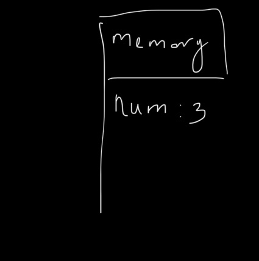

خط دوم فانکشن ما هست که دو قسمت داره اولینش `identifire` هست به این معنی که یک لیبل برای هر چیزی هست که در مموری ذخیره می‌کنیم
در کل هر اسم متغیر و فانکشن `identifire` هست یا همون لیبل برای

در مورد فانکشن یک `identifire` داریم. کد داخل فانگشن بسته‌بندی میشه و ذخیره میشه در مموری

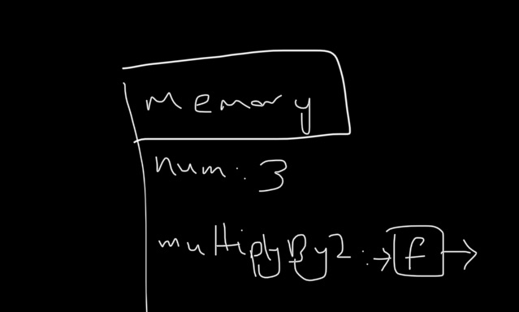

سپس `thread of execution` میره خط های بعدی رو اجرا می‌کنه

کلمه `variable` به این معنی نیست که یک لیبل و دیتا داشته باشیم برای مقداری
لیترالی به معنای این هست که می‌تونیم دیتای  داخل این لیبل رو تغییر بدیم.
با `constant` نمیشه دیتای داخل یک لیبل رو تغییر داد

در خط ۷ کد بالا `output` نمی‌دونیم داخلش قراره چه مقداری باشه چون `function call` یا یک `command` هست
ما فقط می‌تونیم مقادیر (`fixed final things`) رو نگه داریم در مموری
نمی‌تونیم یک استراکچر رو ذهیره کنیم در مموری

در ابتدا `output` مقدارش uninitialized هست و `undefined` باید بشه اما این یک `const` هست و بعدا نمیشه مقدارش رو تغییر داد وقتی فانکشن اکزکیوت شد
مقدارش حتی `undefined` هم نیست هیچ مقداری نداره

```js
const output = multiplyBy2(num)
```

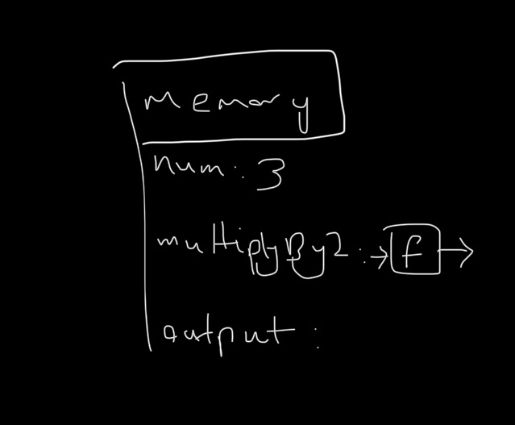

ران کردن کد دو تا مرحله داره اول خط به خط پیش بریم و هر خط انجام بشه دوم جایی داشته باشیم که دیتا رو توش بذاریم

یک فانکشن ران بشه مثل اینه که یک برنامه کوچک داشته باشیم و وقتی فانکشنی رو اجرا می‌کنیم هم دو تا چیز نیازه `thread of execution` و مموری که دیتا  متغیر ها و تمام اجزا کدی که در اون فانکشن موجود هستند ذخیره کنیم

به این دو اجزای مهم برای ران کردن فانکشن `execution context` گفته میشه

وقتی کد گلوبال رو اجرا می‌کنیم بهش `global execution context` می‌گویند

تصویر زیر `execution context` فانکشن `multiplyBy2(3)` :

و چون فانکشن یک برنامه کوچک در نظر گرفتیم برای همین یک `execution context` برای خودش مجزا داره

در مرحله اول پارامتر فانکشن در لوکال مموری ذخیره میشه
نکته: به مقدار اون پارامتر `argument` گفته میشه

بیسیکلی دو تا چیز متفاوت هستند پارامتر حکم لیبل داره و آرگیومنت چیزی هست که در اون لیبل ذخیره میشه.

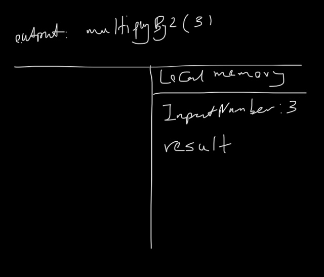

خط اول فانکشن یک `const` داریم با لیبل `result` مقدارش ۶ هست

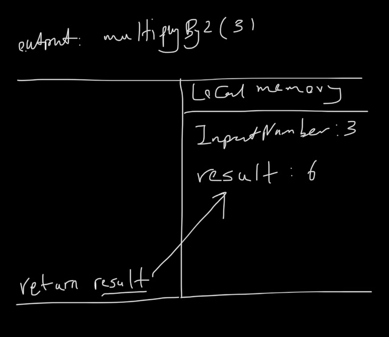

خط اخر میگه برو دیتایی با لیبل `result` رو پیدا کن و مقدارش رو که ۶ هست و انتقال بده به لیبل `output`
بیسیکلی کامند `output = multiplyBy2(3)` رو به یک مقدار تبدیل کردیم که مقدار در لیبل `result` هست

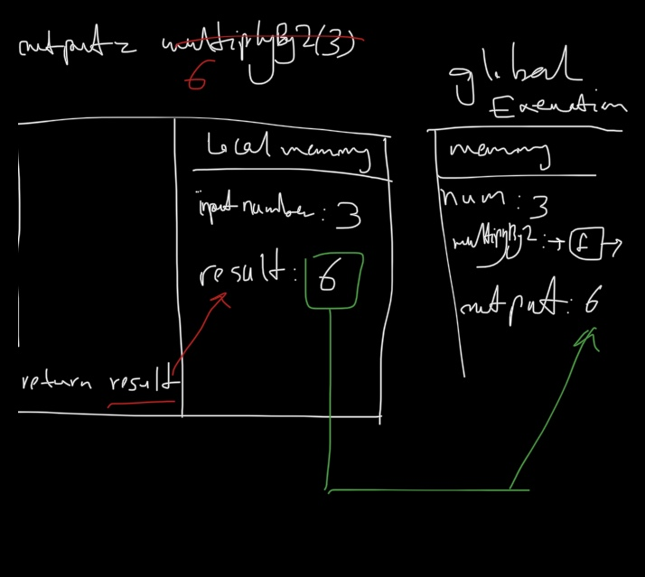

در جاوااسکریپت فقط یک `execution context` داریم یعنی فقط یک کار در آن واحد می‌تونیم انجا بدیم

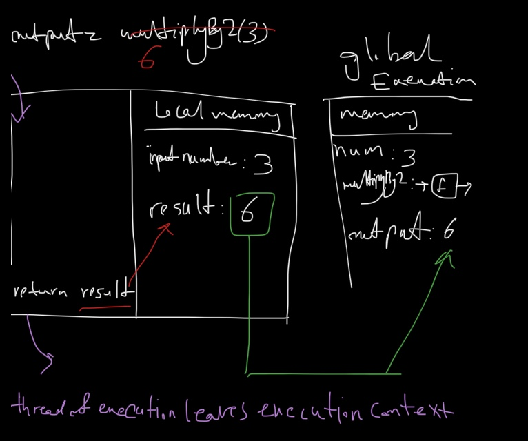

موقع اجرای فانکشن داخل `execution context` فانکشن میشه بعد از ریترن کردن مقدارش ازش خارج میشه و به `global execution context` بر می‌گرده تا خط بعدی رو اجرا کنه که ساخت `newOutput` هست
خب `newOutput` هم مثل مقداری قبلی در ابندا هیچ دیتایی نخواهد داشت و در این مرحله چون فانکشن `multiplyBy2(10)` با مقدار ۱۰ ران میشه یک `execution context` جدید خواهیم داشت

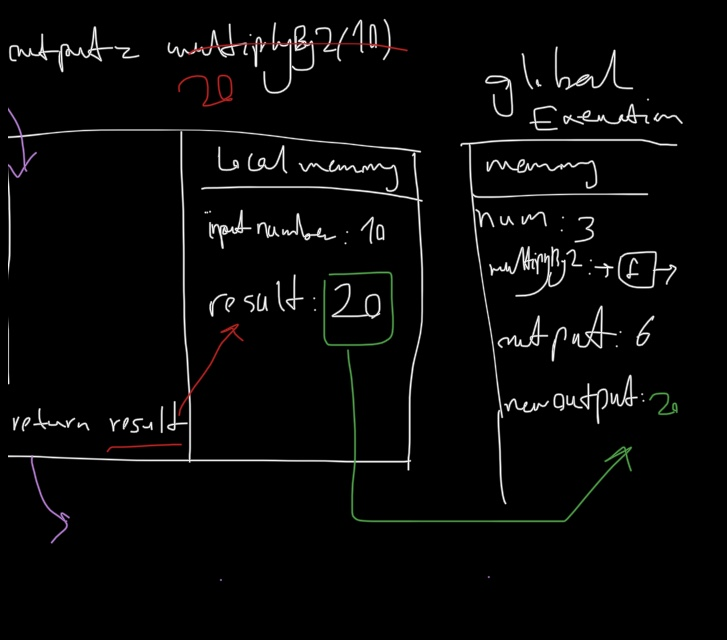

## Call Stack

جاوااسکریپت اینکه کدوم فانکشن در حال حاظر داره ران میشه رو پیگیری می‌کنه که کجای `thread of execution` هستیم

یک قسمتی از انجین جاوااسکریپت `call stack` هست یک روش برای ذخیهر اطلاعات در کامپیوتر هست روش های مختلفی داریم مثل آرایه ها و آبجکت هاو همچین استک‌ها `stacks`  وقتی فانکشی ران میشه به این استک اضافه میشه

اول `multiplyBy2(3)` بهش اضافه میشه و جاوااسکریپت میدونه که چه چیزی در حال حاظر داره ران میشه و `thread of execution` در کجا قرار داره

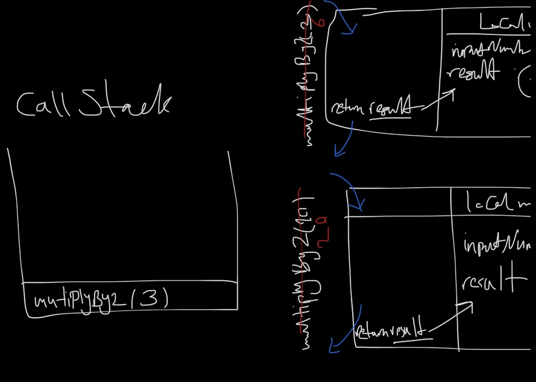

و نکته این هست که چون استک هست هر چیزی که در بالای این استک قرار داره در حال حاظر داره ران میشه
وقتی ران شدن اون فانکشن تموم میشه و کیوردی که به ما می فهمونه اون فانکشن ران شدنش تموم شده `return` هست فانکشن از بالای `call stack` خارج میشه

**سوال: اگر فانکشنی ریترن نداشت از کجا مشخص میشه که ران شدن فانکشن تمام شده؟**

توجه باید بشه که همیشه در پایین ترین قسمت کال استک `global execution context` قرار داره میشه اینجوری در نظر گرفت که همه کد ها داخل یک فانکشن با لیبل `global` قرار داره و لحظه ای که کد ما ران میشه `global()` به پایین `call stack` اضافه میشه پس
فانکشن `multiplyBy2(3)` بالای `global()` قرار می‌گیره و وقتی `multiplyBy2(3)` از استک خارج میشه `thread of execution` میره سراغ `global()`

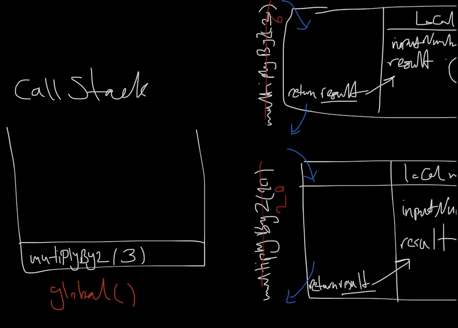

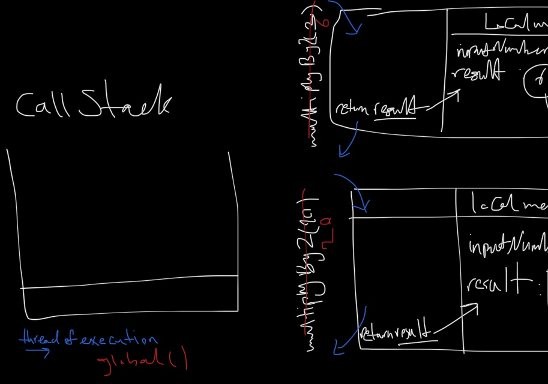

بعد از آن می‌رسیم به `multiplyBy2(10)` و داخل `call stack` میره و وقتی ران شد و تمام شد از استک خارج شد  دوباره بر می‌گردیم به `global()`

اگر فانکشن دیگه ای داخل `multiplyBy2()` داشتیم و در همان فانکشن کال میشد اون فانکشن بالای `multiplyBy2(10)` در `call stack` قرار میگرفت

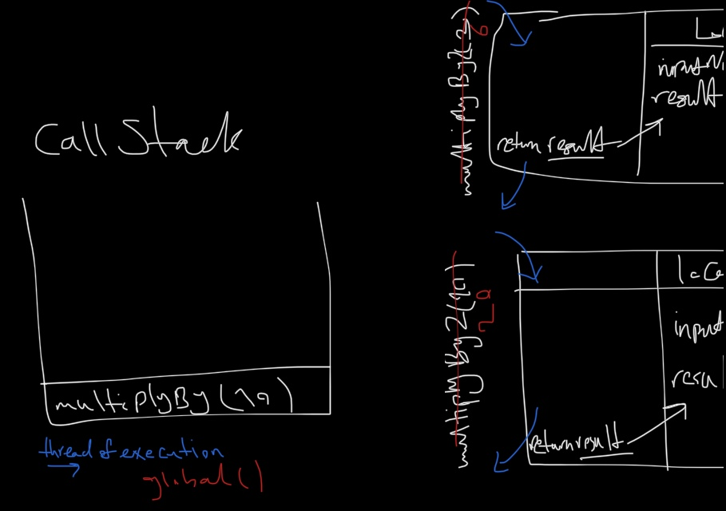


پس هر چقدر فانکشن تو در تو داشته باشیم به تریتیب توی `call stack` قرار میگرند و اخرین فانکشنی که ران میشه بالاترین آیتمی هست که در `call stack` قرار داره
و خارج شدن از کال استک هم به ترتیب از بالا به پایین هست چون `LIFO` هست

___

تا اینجا `memory` بر رسی کردیم که دیتا و قطعه کد توش ذخیره میشه که بعدا میتون اجرا بشه
مبحث بعدی `thread of execution` هست که در کد خط به خط حرکت می‌کنیم و مقادیر و دیتا رو ذخیره میکنیم تو مموری و همچنین برخی از قطعه کد ها (فانکشنالیتی‌های) ذخیره شده رو ران می‌کنیم و  `execution context` ای داریم برای اون فانکشن و وقتی ران شدن فانکشن تموم شد و خروجی مشخص شد از حافظه حذف میشه و به سراغ بقیه کد میره
سومین مبحث هم `call stack` بود که مشخص میکنه کجای `thread of execution` هستیم

## Generalized Funtions

چرا به فانکشن‌ها احتیاج داریم
وقتی به کیورد fucntion میرسیم جاواساکریپت فانکشن رو در مموری ذخیره میکنه

```js
function tenTimesTen(){
  return 10 * 10
}
```

حالا اگر `9^2` رو بخوایم

```js
function nineTimesNine(){
  return 9 * 9
}
```

همونطور که مشخص هست قانون `DRY (Don't Repeat Yourself)` رو رعایت نشده
برای هر تسک نمی‌خوایم کد تکراری بنویسیم
در مورد این فانکشن مقداری در خودش ضرب میشه پس اون عدد می‌تونیم به صورت ورودی بگیریم می تونیم فانکشن رو جنرال بنویسیم همین کار رو با گرفتن یک پارامتر انجام بده و `reusable` می‌کنیم فانکشنمون رو

```js
function squareNum(num){
  return num * num
}
```

پارامتر `placeholder` هایی هستند که با کمک آن‌ها نیازی به تصمیم گیری در مورد اینکه چه داده هایی را اجرا کنیم
نداریم تا زمانیکه فانکشن رو ران کنیم با مقدار `argument` ای که پس می‌کنیم بهش

با همین ایده مبحث `higher order funtion` قابل پیاده سازی هست

## Repeating Functionality

```js
function copyArrayAndMultiplyBy2(array) {
  const output = [];
  for (let i = 0; i < array.length; i++) {
    output.push(array[i] * 2);
  }
  return output;
}
const myArray = [1,2,3];
const result = copyArrayAndMultiplyBy2(myArray);
```

مراحل اجرای فانکشن بالا به صورت زیراست
با لیبل `copyArrayAndMultiplyBy2` کد فانکشن تو مموری ذخیره میشه بعد میرسیم به `myArray` در مموری آرایه با این لیبل ذخیره میشه و سپس `result` داریم که فانکشن با لیبل `copyArrayAndMultiplyBy2` رو ران می‌کنه تا خروجی فانکشن مشخص نیشه این لیبل مقداری نداره

بعد ران شدن فانکشن یک `execution context` داریم
در لوکال مموری پارامتر ها و متغیر های داخل فانکشن رو ذخیره میکنیم

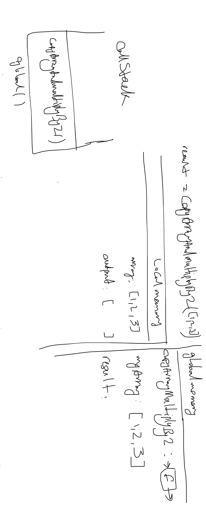

به `for loop` می رسیم
می‌دونیم که این قطعه کد تا زمانی که `i < array.length` هست اجرا می‌شه

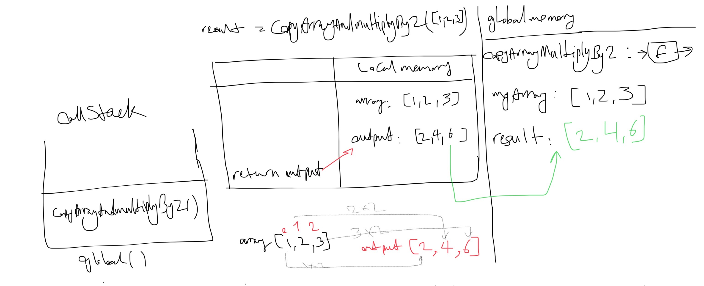

و در نهایت فانکشن `copyArrayAndMultiplyBy2()` از `call stack` خارج میشه

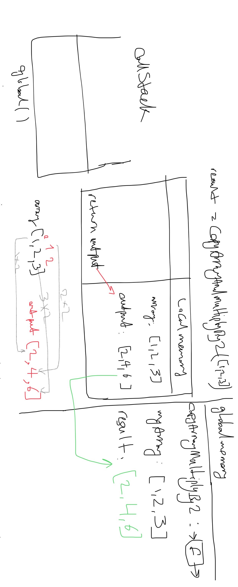

## higher order functions

تفاوت فانکشن قبلی با این فانکشن‌های پایین در عمل ریاضی هست

```js
function copyArrayAndDivideBy2(array) {
  const output = [];
  for (let i = 0; i < array.length; i++) {
    output.push(array[i] / 2);
  }
  return output;
 }
const myArray = [1,2,3];
const result = copyArrayAndDivideBy2(myArray);
```

```js
function copyArrayAndAdd3(array) {
 const output = [];
  for (let i = 0; i < array.length; i++) {
    output.push(array[i] + 3);
    }
  return output;
 }
const myArray = [1,2,3];
const result = copyArrayAndAdd3(myArray);
```

این فانکشن ها شبیه به هم هستند فقط در اعمال ریاضیات که روی مقادیر ارایه اعمال میشه تفاوت دارند

فانکشن رو میتونیم `generalize` بکنیم
هر عمل روی فانکشن رو می‌تونیم به عنوان پارامتر پس بدیم به فانکشن

فانکشن های بالا به فانکشن زیر قابل تغییر هستند

```js
function copyArrayAndManipulate(array, instructions) {
 const output = [];
  for (let i = 0; i < array.length; i++) {
    output.push(instructions(array[i]));
  }
  return output;
}

function multiplyBy2(input) { return input * 2; }

const result = copyArrayAndManipulate([1, 2, 3], multiplyBy2);
```

اجرای کد بالا به صورت زیر
ابتدل مثل فانکشن های قبل همه فانکشن ها و متغیر ها در مموری قرار میگیره

فانکشن اصلی در `call stack` قرار میگیره سپس خط به خط کد داخل فانکشن اجرا میشه

در این فانکشن به عنوان پارامتر فانکشن دیگه ای  پس شده که وقتی اجرا میشه فانکشن مد نظر داخل `call stack` قرار میگیره و  برای خودش هم یک `execution context` داره

هر بار مقدار یک خانه از ارایه داخل به عنوان پارامتر به فانکشن `multiplyBy2` پس میشه و خروجی این فانکشن در آرایه `output` پوش میشه
هر باری که فانکشن `multiplyBy2` کال میشه یک `execution context` براش ساخته میشه با مقدار هر خانه از ارایه که در اون ایندکس قرار داریم


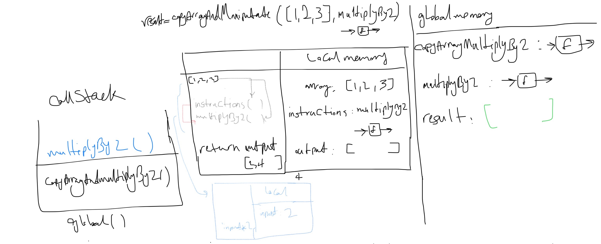


مقادیر `output` ریترن میشه به مموری و داخل لیبل `result` قرار میگیره و در نهایت فانکشن از `call stack` خارج شده و تنها فانکشنی که در `call stack` قرار داره ‍`global()` هست.

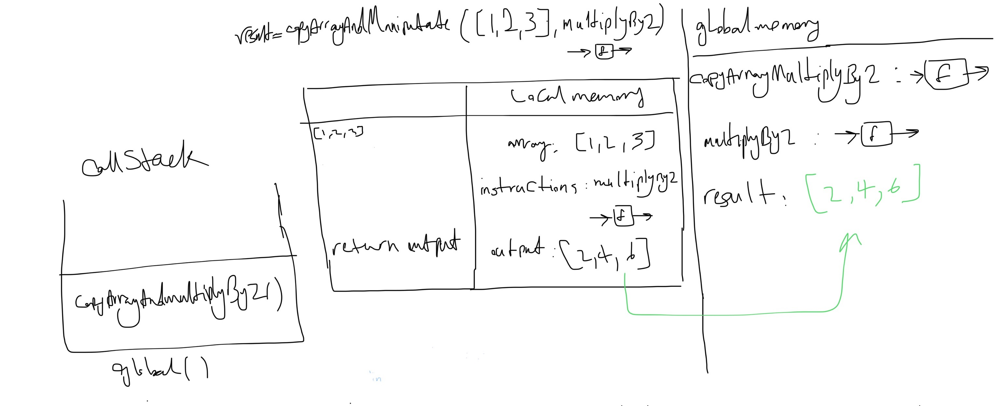

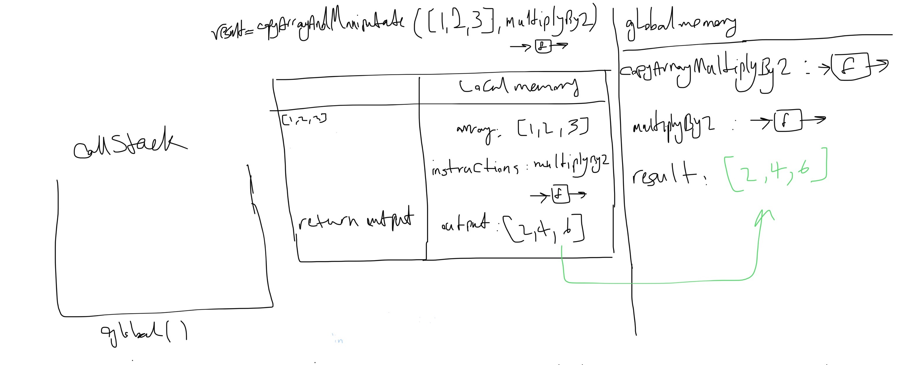

تعریف `higher order function` میشه تابع بیرونی که فانکشن‌ها رو قبول می‌کنده
و به فانکشنی داخل این فانکشن وارد می‌کنیم `callback` گفته میشه

در مثال قبل `copyArrayAndManipulate([1, 2, 3], multiplyBy2)` آرایه گلوبال هست و به فانکشن مستقیما پس شده و
در عکس زیر مشخص هست که `array` درفانکشن به این آرایه لینک شده و کپی نشده و در `array` یک رفرنس به اون آرایه داریم


در فانکشن های قبل یک متغیر گلوبال داشتیم


در این مثال `myArray` به همراه مقدار `[1,2,3]` در گلوبال مموری ذخیره شد و پارامتر بهش لینک شده
برای همین هست که نمی‌خوایم دیتایی که ورودی فانکشن هست تغییر کنه  داخل فانکشن به خاطر اینکه ممکنه روی دیتای گلوبال هم تغییراتی بده

**side Effect**

هر گونه تأثیر یک تابع بر روی چیزی خارج از خودش که به نتیجه بازگشتی آن تابع مربوط نمی‌شود، یک `side Effect` است

به عنوان مثال، فرض کنید تابعی داریم که مقداری را درون یک متغیر گلوبال ذخیره می‌کند. ذخیره‌سازی این مقدار در متغیر گلوبال (که ممکن است در جای دیگری از برنامه استفاده شود)، یک ساید افکت محسوب می‌شود چرا که تابع بر روی وضعیت خارجی برنامه تأثیر می‌گذارد.

ساید افکت شامل عملیات‌هایی مانند تغییر مقادیر متغیرها، نوشتن داده‌ها به یک پایگاه داده یا فایل، یا ارسال یک درخواست شبکه می‌شود. در حالی که عوارض جانبی در برنامه‌نویسی اجتناب‌ناپذیر هستند و گاهی اوقات لازم، برنامه‌نویسان سعی می‌کنند توابع خود را به گونه‌ای طراحی کنند که حداقل عوارض جانبی داشته باشند، زیرا این امر می‌تواند درک و نگهداری کد را آسان‌تر کند.

در مثال قبل آرایه گلوبال به فانکشن داده میشه فانکشن مقادیر اون رو میگیره و تغییراتی اعمال می‌کنه و در یک متغیر لوکال قرار میده این باعث میشه آرایه ورودی `unmutated` بمونه


در مورد فانکشن که به صورت کالبک به فانکشن `copyArrayAndManipulate` داده شده یک لیبل داریم براش به نام `instructions` و که در `execution context` فانکشن اصلی به فانکشن در گلوبال مموری `multiplyBy2` هست اشاره میکنه و یک لینک هست به بخشی امموری که کد این فانکشن ذخیره شده و هر وقت کال شد ران میشه

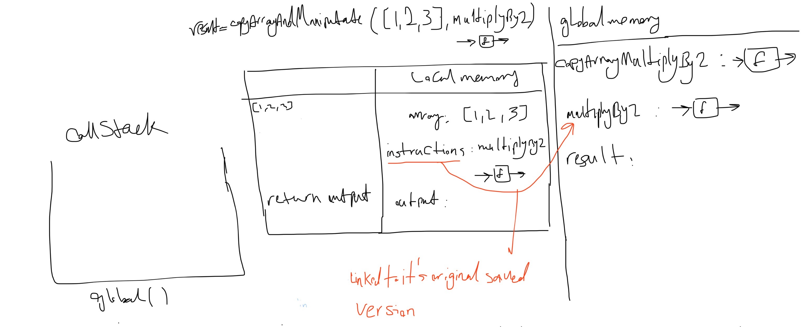

در همین مثال یک `for loop` داریم که برای لوپ ها `execution context` نداریم
اما لوپ یک `protected namespace` داره
در این لوپ یک`let i = 0` داریم که ای `i` فقط داخل این بلاک `{}` از کد در دسترس هست یک بخش `protected` در مموری هست برای مقادیر این بلاک

## callback

در جاوا اسکریپت فانکشن ها `first class objects` هستند یعنی همه فیچرهای یک ابجکت را دارا هستند
پس مثل ابجکت ها میشه باهاشو رفتار کرد

می‌تونیم داخل متغیر ها بذاریمشون
به عنوان پراپرتی آبجکت ها تعریف بشوند که بهش متود می‌گوییم
به عنوان آرگیومنت یک فانکشن‌ها تعریف بشوند و داخل فانکشن‌ها ازشون استفاده بشه (کپی با رفرنس میشوند)
به عنوان خروجی فانکشن ریترن بشوند که بهش `closure` می‌گیم

