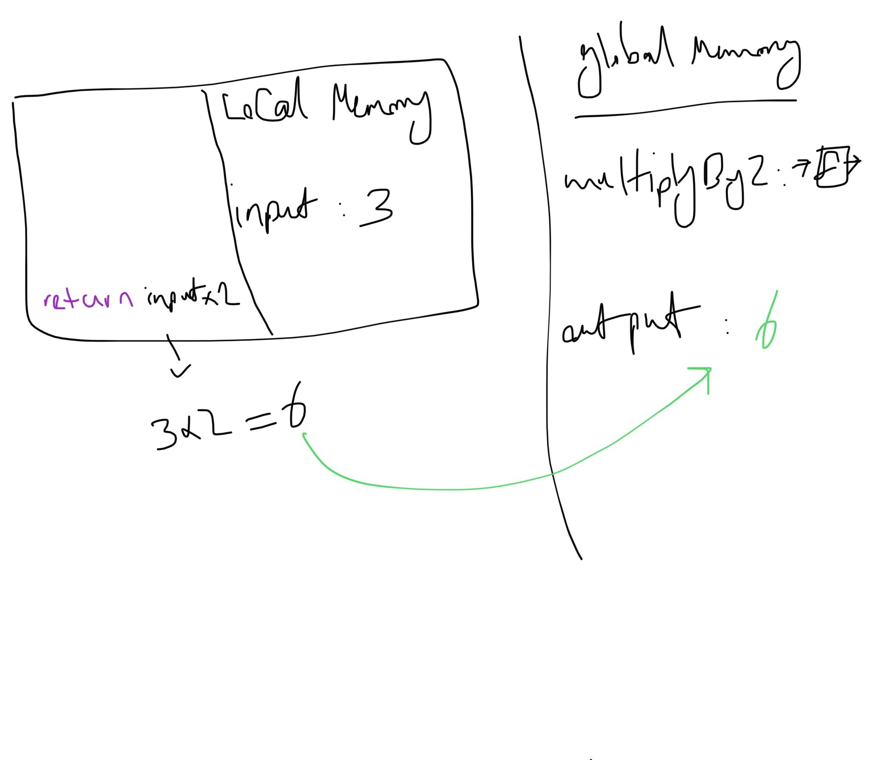

# JavaScript principles

جاوااسکریپت خط به خط کد ها رو ران می‌کنه `thread of execution` بهش میگن
به این معنی که به سمت پایین سورس کد حرکت میکنه و هر خط از سورس رو همون موقع اجرا می‌کنه

جاوااسکریپت دیتا رو توی مموری سیو میکنه استرینگ و آرایه حتی قطعه کد ها هم میشه تو مموری سیو کرد( برای مثال فانکشن ها)

```js
const num = 3;
funtion multiplyBy2(inputNumber){
  const result = inputNumber * 2
  return result
}

const output = multiplyBy2(num)
const newOutput = multiplyBy2(10)
```

خط اول با اسم `num` تو مموری ذخیره میشه


خط دوم فانکشن ما هست که دو قسمت داره اولینش `identifire` هست به این معنی که یک لیبل برای هر چیزی هست که در مموری ذخیره می‌کنیم
در کل هر اسم متغیر و فانکشن `identifire` هست یا همون لیبل برای

در مورد فانکشن یک `identifire` داریم. کد داخل فانگشن بسته‌بندی میشه و ذخیره میشه در مموری


سپس `thread of execution` میره خط های بعدی رو اجرا می‌کنه

کلمه `variable` به این معنی نیست که یک لیبل و دیتا داشته باشیم برای مقداری
لیترالی به معنای این هست که می‌تونیم دیتای داخل این لیبل رو تغییر بدیم.
با `constant` نمیشه دیتای داخل یک لیبل رو تغییر داد

در خط ۷ کد بالا `output` نمی‌دونیم داخلش قراره چه مقداری باشه چون `function call` یا یک `command` هست
ما فقط می‌تونیم مقادیر (`fixed final things`) رو نگه داریم در مموری
نمی‌تونیم یک استراکچر رو ذهیره کنیم در مموری

در ابتدا `output` مقدارش uninitialized هست و `undefined` باید بشه اما این یک `const` هست و بعدا نمیشه مقدارش رو تغییر داد وقتی فانکشن اکزکیوت شد
مقدارش حتی `undefined` هم نیست هیچ مقداری نداره

```js
const output = multiplyBy2(num);
```


ران کردن کد دو تا مرحله داره اول خط به خط پیش بریم و هر خط انجام بشه دوم جایی داشته باشیم که دیتا رو توش بذاریم

یک فانکشن ران بشه مثل اینه که یک برنامه کوچک داشته باشیم و وقتی فانکشنی رو اجرا می‌کنیم هم دو تا چیز نیازه `thread of execution` و مموری که دیتا متغیر ها و تمام اجزا کدی که در اون فانکشن موجود هستند ذخیره کنیم

به این دو اجزای مهم برای ران کردن فانکشن `execution context` گفته میشه

وقتی کد گلوبال رو اجرا می‌کنیم بهش `global execution context` می‌گویند

تصویر زیر `execution context` فانکشن `multiplyBy2(3)` :

و چون فانکشن یک برنامه کوچک در نظر گرفتیم برای همین یک `execution context` برای خودش مجزا داره

در مرحله اول پارامتر فانکشن در لوکال مموری ذخیره میشه
نکته: به مقدار اون پارامتر `argument` گفته میشه

بیسیکلی دو تا چیز متفاوت هستند پارامتر حکم لیبل داره و آرگیومنت چیزی هست که در اون لیبل ذخیره میشه.


خط اول فانکشن یک `const` داریم با لیبل `result` مقدارش ۶ هست


خط اخر میگه برو دیتایی با لیبل `result` رو پیدا کن و مقدارش رو که ۶ هست و انتقال بده به لیبل `output`
بیسیکلی کامند `output = multiplyBy2(3)` رو به یک مقدار تبدیل کردیم که مقدار در لیبل `result` هست


در جاوااسکریپت فقط یک `execution context` داریم یعنی فقط یک کار در آن واحد می‌تونیم انجا بدیم


موقع اجرای فانکشن داخل `execution context` فانکشن میشه بعد از ریترن کردن مقدارش ازش خارج میشه و به `global execution context` بر می‌گرده تا خط بعدی رو اجرا کنه که ساخت `newOutput` هست
خب `newOutput` هم مثل مقداری قبلی در ابندا هیچ دیتایی نخواهد داشت و در این مرحله چون فانکشن `multiplyBy2(10)` با مقدار ۱۰ ران میشه یک `execution context` جدید خواهیم داشت


## Call Stack

جاوااسکریپت اینکه کدوم فانکشن در حال حاظر داره ران میشه رو پیگیری می‌کنه که کجای `thread of execution` هستیم

یک قسمتی از انجین جاوااسکریپت `call stack` هست یک روش برای ذخیهر اطلاعات در کامپیوتر هست روش های مختلفی داریم مثل آرایه ها و آبجکت هاو همچین استک‌ها `stacks` وقتی فانکشی ران میشه به این استک اضافه میشه

اول `multiplyBy2(3)` بهش اضافه میشه و جاوااسکریپت میدونه که چه چیزی در حال حاظر داره ران میشه و `thread of execution` در کجا قرار داره


و نکته این هست که چون استک هست هر چیزی که در بالای این استک قرار داره در حال حاظر داره ران میشه
وقتی ران شدن اون فانکشن تموم میشه و کیوردی که به ما می فهمونه اون فانکشن ران شدنش تموم شده `return` هست فانکشن از بالای `call stack` خارج میشه

**سوال: اگر فانکشنی ریترن نداشت از کجا مشخص میشه که ران شدن فانکشن تمام شده؟**

توجه باید بشه که همیشه در پایین ترین قسمت کال استک `global execution context` قرار داره میشه اینجوری در نظر گرفت که همه کد ها داخل یک فانکشن با لیبل `global` قرار داره و لحظه ای که کد ما ران میشه `global()` به پایین `call stack` اضافه میشه پس
فانکشن `multiplyBy2(3)` بالای `global()` قرار می‌گیره و وقتی `multiplyBy2(3)` از استک خارج میشه `thread of execution` میره سراغ `global()`


بعد از آن می‌رسیم به `multiplyBy2(10)` و داخل `call stack` میره و وقتی ران شد و تمام شد از استک خارج شد دوباره بر می‌گردیم به `global()`

اگر فانکشن دیگه ای داخل `multiplyBy2()` داشتیم و در همان فانکشن کال میشد اون فانکشن بالای `multiplyBy2(10)` در `call stack` قرار میگرفت


پس هر چقدر فانکشن تو در تو داشته باشیم به تریتیب توی `call stack` قرار میگرند و اخرین فانکشنی که ران میشه بالاترین آیتمی هست که در `call stack` قرار داره
و خارج شدن از کال استک هم به ترتیب از بالا به پایین هست چون `LIFO` هست

---

تا اینجا `memory` بر رسی کردیم که دیتا و قطعه کد توش ذخیره میشه که بعدا میتون اجرا بشه
مبحث بعدی `thread of execution` هست که در کد خط به خط حرکت می‌کنیم و مقادیر و دیتا رو ذخیره میکنیم تو مموری و همچنین برخی از قطعه کد ها (فانکشنالیتی‌های) ذخیره شده رو ران می‌کنیم و `execution context` ای داریم برای اون فانکشن و وقتی ران شدن فانکشن تموم شد و خروجی مشخص شد از حافظه حذف میشه و به سراغ بقیه کد میره
سومین مبحث هم `call stack` بود که مشخص میکنه کجای `thread of execution` هستیم

## Generalized Funtions

چرا به فانکشن‌ها احتیاج داریم
وقتی به کیورد fucntion میرسیم جاواساکریپت فانکشن رو در مموری ذخیره میکنه

```js
function tenTimesTen() {
  return 10 * 10;
}
```

حالا اگر `9^2` رو بخوایم

```js
function nineTimesNine() {
  return 9 * 9;
}
```

همونطور که مشخص هست قانون `DRY (Don't Repeat Yourself)` رو رعایت نشده
برای هر تسک نمی‌خوایم کد تکراری بنویسیم
در مورد این فانکشن مقداری در خودش ضرب میشه پس اون عدد می‌تونیم به صورت ورودی بگیریم می تونیم فانکشن رو جنرال بنویسیم همین کار رو با گرفتن یک پارامتر انجام بده و `reusable` می‌کنیم فانکشنمون رو

```js
function squareNum(num) {
  return num * num;
}
```

پارامتر `placeholder` هایی هستند که با کمک آن‌ها نیازی به تصمیم گیری در مورد اینکه چه داده هایی را اجرا کنیم
نداریم تا زمانیکه فانکشن رو ران کنیم با مقدار `argument` ای که پس می‌کنیم بهش

با همین ایده مبحث `higher order funtion` قابل پیاده سازی هست

## Repeating Functionality

```js
function copyArrayAndMultiplyBy2(array) {
  const output = [];
  for (let i = 0; i < array.length; i++) {
    output.push(array[i] * 2);
  }
  return output;
}
const myArray = [1, 2, 3];
const result = copyArrayAndMultiplyBy2(myArray);
```

مراحل اجرای فانکشن بالا به صورت زیراست
با لیبل `copyArrayAndMultiplyBy2` کد فانکشن تو مموری ذخیره میشه بعد میرسیم به `myArray` در مموری آرایه با این لیبل ذخیره میشه و سپس `result` داریم که فانکشن با لیبل `copyArrayAndMultiplyBy2` رو ران می‌کنه تا خروجی فانکشن مشخص نیشه این لیبل مقداری نداره

بعد ران شدن فانکشن یک `execution context` داریم
در لوکال مموری پارامتر ها و متغیر های داخل فانکشن رو ذخیره میکنیم


به `for loop` می رسیم
می‌دونیم که این قطعه کد تا زمانی که `i < array.length` هست اجرا می‌شه


و در نهایت فانکشن `copyArrayAndMultiplyBy2()` از `call stack` خارج میشه


## higher order functions

تفاوت فانکشن قبلی با این فانکشن‌های پایین در عمل ریاضی هست

```js
function copyArrayAndDivideBy2(array) {
  const output = [];
  for (let i = 0; i < array.length; i++) {
    output.push(array[i] / 2);
  }
  return output;
}
const myArray = [1, 2, 3];
const result = copyArrayAndDivideBy2(myArray);
```

```js
function copyArrayAndAdd3(array) {
  const output = [];
  for (let i = 0; i < array.length; i++) {
    output.push(array[i] + 3);
  }
  return output;
}
const myArray = [1, 2, 3];
const result = copyArrayAndAdd3(myArray);
```

این فانکشن ها شبیه به هم هستند فقط در اعمال ریاضیات که روی مقادیر ارایه اعمال میشه تفاوت دارند

فانکشن رو میتونیم `generalize` بکنیم
هر عمل روی فانکشن رو می‌تونیم به عنوان پارامتر پس بدیم به فانکشن

فانکشن های بالا به فانکشن زیر قابل تغییر هستند

```js
function copyArrayAndManipulate(array, instructions) {
  const output = [];
  for (let i = 0; i < array.length; i++) {
    output.push(instructions(array[i]));
  }
  return output;
}

function multiplyBy2(input) {
  return input * 2;
}

const result = copyArrayAndManipulate([1, 2, 3], multiplyBy2);
```

اجرای کد بالا به صورت زیر
ابتدل مثل فانکشن های قبل همه فانکشن ها و متغیر ها در مموری قرار میگیره

فانکشن اصلی در `call stack` قرار میگیره سپس خط به خط کد داخل فانکشن اجرا میشه

در این فانکشن به عنوان پارامتر فانکشن دیگه ای پس شده که وقتی اجرا میشه فانکشن مد نظر داخل `call stack` قرار میگیره و برای خودش هم یک `execution context` داره

هر بار مقدار یک خانه از ارایه داخل به عنوان پارامتر به فانکشن `multiplyBy2` پس میشه و خروجی این فانکشن در آرایه `output` پوش میشه
هر باری که فانکشن `multiplyBy2` کال میشه یک `execution context` براش ساخته میشه با مقدار هر خانه از ارایه که در اون ایندکس قرار داریم


مقادیر `output` ریترن میشه به مموری و داخل لیبل `result` قرار میگیره و در نهایت فانکشن از `call stack` خارج شده و تنها فانکشنی که در `call stack` قرار داره ‍`global()` هست.


در مثال قبل `copyArrayAndManipulate([1, 2, 3], multiplyBy2)` آرایه گلوبال هست و به فانکشن مستقیما پس شده و
در عکس زیر مشخص هست که `array` درفانکشن به این آرایه لینک شده و کپی نشده و در `array` یک رفرنس به اون آرایه داریم


در فانکشن های قبل یک متغیر گلوبال داشتیم


در این مثال `myArray` به همراه مقدار `[1,2,3]` در گلوبال مموری ذخیره شد و پارامتر بهش لینک شده
برای همین هست که نمی‌خوایم دیتایی که ورودی فانکشن هست تغییر کنه داخل فانکشن به خاطر اینکه ممکنه روی دیتای گلوبال هم تغییراتی بده

**side Effect**

هر گونه تأثیر یک تابع بر روی چیزی خارج از خودش که به نتیجه بازگشتی آن تابع مربوط نمی‌شود، یک `side Effect` است

به عنوان مثال، فرض کنید تابعی داریم که مقداری را درون یک متغیر گلوبال ذخیره می‌کند. ذخیره‌سازی این مقدار در متغیر گلوبال (که ممکن است در جای دیگری از برنامه استفاده شود)، یک ساید افکت محسوب می‌شود چرا که تابع بر روی وضعیت خارجی برنامه تأثیر می‌گذارد.

ساید افکت شامل عملیات‌هایی مانند تغییر مقادیر متغیرها، نوشتن داده‌ها به یک پایگاه داده یا فایل، یا ارسال یک درخواست شبکه می‌شود. در حالی که عوارض جانبی در برنامه‌نویسی اجتناب‌ناپذیر هستند و گاهی اوقات لازم، برنامه‌نویسان سعی می‌کنند توابع خود را به گونه‌ای طراحی کنند که حداقل عوارض جانبی داشته باشند، زیرا این امر می‌تواند درک و نگهداری کد را آسان‌تر کند.

در مثال قبل آرایه گلوبال به فانکشن داده میشه فانکشن مقادیر اون رو میگیره و تغییراتی اعمال می‌کنه و در یک متغیر لوکال قرار میده این باعث میشه آرایه ورودی `unmutated` بمونه


در مورد فانکشن که به صورت کالبک به فانکشن `copyArrayAndManipulate` داده شده یک لیبل داریم براش به نام `instructions` و که در `execution context` فانکشن اصلی به فانکشن در گلوبال مموری `multiplyBy2` هست اشاره میکنه و یک لینک هست به بخشی امموری که کد این فانکشن ذخیره شده و هر وقت کال شد ران میشه


در همین مثال یک `for loop` داریم که برای لوپ ها `execution context` نداریم
اما لوپ یک `protected namespace` داره
در این لوپ یک`let i = 0` داریم که ای `i` فقط داخل این بلاک `{}` از کد در دسترس هست یک بخش `protected` در مموری هست برای مقادیر این بلاک

## callback

در جاوا اسکریپت فانکشن ها `first class objects` هستند یعنی همه فیچرهای یک ابجکت را دارا هستند
پس مثل ابجکت ها میشه باهاشو رفتار کرد

می‌تونیم داخل متغیر ها بذاریمشون
به عنوان پراپرتی آبجکت ها تعریف بشوند که بهش متود می‌گوییم
به عنوان آرگیومنت یک فانکشن‌ها تعریف بشوند و داخل فانکشن‌ها ازشون استفاده بشه (کپی با رفرنس میشوند)
به عنوان خروجی فانکشن ریترن بشوند که بهش `closure` می‌گیم

تعریف `higher order function` میشه تابع بیرونی که فانکشن‌ها رو قبول می‌کنده
و به فانکشنی داخل این فانکشن وارد می‌کنیم `callback` گفته میشه
در مثال زیر `copyArrayAndManipulate` میشه `higher order function` و `multiplyBy2` میشه `callback`

فانکشن بیرونی که فانکشن کوچیک دیگه رو داخل خودش قبول میکنه میشه `higher order function`
فانکشنی که وارد فانکشن دیگه به عنوان آرگیومنت پس میدیم میشه `callback`

فانکشنی که فانکشنی را ریترن میکند هم `higher order function` هست

```js
function copyArrayAndManipulate(array, instructions) {
  const output = [];
  for (let i = 0; i < array.length; i++) {
    output.push(instructions(array[i]));
  }
  return output;
}
function multiplyBy2(input) {
  return input * 2;
}
const result = copyArrayAndManipulate([1, 2, 3], multiplyBy2);
```

کالبک ها و `higher order function` ها کمک می‌کنند به `DRY`

فانکشن بالا کاری میکنه که متود `map` روی ارایه ها انجام میده
یک سری دیتا به صورت ارایه می‌گیره و یک سری تغییرات روی دیتا انجام میده و کالکشنی جدید از دیتا ایجاد میکنه
کد خوانا تر و `declarative` خواهیم داشت

نکته: کالبک ها پایه و اساس `asynchronous` در جاوا اسکریپت هستند `promis` ها و `async/await`

## Arrow Funtions

در مثال زیر مشخص هست که یک فانکشن داریم
چون کیورد فانکشن موجود هست

```js
function multiplyBy2(input) {
  return input * 2;
}
```

به روش دیگه ای هم میشه این فانکشن را تعریف کرد چون فانکشن ها در جاوا اسکریپت ابجکت هستند پس می‌تونیم توی یک متغیر ذخیرشون کنیم
در مثال زیر کد سما راست رو در لیبل `multiplyBy2` ذخیره می‌کنیم

```js
const multiplyBy2 = (input) => {
  return input * 2;
};
```

نحوه ذخیره هر دو فانکشن در مموری مثل هم هست


حتی می‌تونیم فانکشن رو به این صورت ها هم بنویسیم

```js
const multiplyBy2 = (input) => input * 2;

//or

const multiplyBy2 = (input) => input * 2; // because we have one parameter

const output = multiplyBy2(3); //6
```

در بالا `return` حذف شده مشکلی ایجاد نمی‌کنه چون انجین جاوااسکریپت وقتی کد رو روان میکنه خودش `return` پشت مقداری که قراره ریترن بشه قرار میده



مستقیم خود `arrow function` میشه به عنوان `argument` گذاشت

```js
const result = copyArrayAndManipulate([1, 2, 3], (input) => input * 2);
```

کد `input => input*2` مستقیما داخل `higher order function` قرار می‌گیره


کد بالا برای خوانایی مناسب هست و استاندارد هست
اما همیشه نباید ازشون استفاده کنیم

اما `arrow function` ها متفاوت با فانکشنی که با کیورد`function` تعریف شده ها با `this` برخورد می‌کنند ی

## closures

فانکشنی که فانکشن های دیگه رو به فانکشن هایی که یک بار ران بشن تبدیل بکنه و اگر دوباره ران بشن کار نخواهند کرد
اما فانکشن ها از اجرای قبلی چیزی به یاد نمی‌اوردند اما این توصبف به این معنی هست که به یاد خواهند اورد که قبلا اجرا شدند و نیازی نیست دوباره ران بشن
با کمکش `memoization` داریم که کمک میکنه به بهینه سازی کدهامون

کمک کندده هست که تسک ها و محسباتی که قبلا انجام شدن رو دوباره تکرار نکنیم
بسیاری از دیزاین پترن های `js` برای مثال `module pattern` از `closure` استفاده می‌کنند

کاربرد هاش در `iterators` و `curry` و `partial applications` و `maintain state in asynchronous`

هر باری که فانکشنی رو ران می‌کنیم یک `execution contect` ایجاد میشه که یک لوکال مموری یا `variable environment` به صورت `temporary` داره
چون نیازی نیست فانکشن بدونه قبلا ران شده و چه مقادیری به عنوان پارامتر بهش پس شده
و کارکرد فانکشن هم به همین صورت هست
به `variable environment` میشه `state` نامید دیتای live در زمان اجرای این فانکشن در مموری لوکال ذخیره شده

```js
function multiplyBy2(inputNumber) {
  const result = inputNumber * 2;
  return result;
}
const output = multiplyBy2(7);
```

در مثال بالا استیت فانکشن موقع اجرا شدن ۷ است
بعد اجرای فانکشن لوکال مموری حذف میشه به جز مقداری که ریترن میشه از این فانکشن
برنامه قابلیت اینکه فانکشن `permanent memory` داشته باشه داریم اون استیت رو نگه داریم و فانکشن یاداوری داشته باشه از اجرای قبلیش
یعنی `function definition` نه فقط وقتی که ران میشه بلکه خود فانکشن مموری داشته باشه و به یاد بیاره با همین مقادیر ورودی قبلا اجرا شده و دوباره اجرا نشه و با این ویژگی میتونیم محدود کنیم که فقط یک بار ران بشه

با ریترن یک فانکشن از invocation و اجرای فانکشن دیگر

فانکشن ها می‌تونن از فانکشن های دیگه ریترن بشن

```js
function createFunction() {
  function multiplyBy2(num) {
    return num * 2;
  }
  return multiplyBy2;
}
const generatedFunc = createFunction();
const result = generatedFunc(3); // 6
```

یک فانشکن به نام createFunction داریم
یک لیبل داریم به نام `generatedFunc` که داخلش خروجی `createFunction()` قرار خواهد گرفت

مثل مطالب قبلی فانشکن اجرا میشه داخل این فانکشن چی قرار داره؟ یک فانکشن دیگه به نام `multiplyBy2` چیزی که ریترن داده شده این فانکشن هست
پس `generatedFunc` یه لیبل برای فانشکن `multiplyBy2` هست
در لوکال مموری `multiplyBy2` داریم که بعد از از بین رفتن `execution context` فانشکن `createFunction()` حذف میشه
اما این `multiplyBy2` در `generatedFunc` خواهیم داشت به این صورت به اون فانکشن دسترسی خواهیم داشت از طریق `generatedFunc`

اجرای کد بالا به ترتیب زیر است


در مرحله بالا `execution context` حذف میشه

به خط بعدی میریم

جاوااسکریپت زبان synchronous هست یک بار اجرا میشه و دیگه سراغ اون کد نمیره

این `generatedFunc` کدی هست که در مرحله قبل به عنوان `multiplyBy2` بوده و هیچ کانکشنی به `createFunction()` نداره فقط به وسیله این فانکشن مقدار دهی شده

چون در کد می‌بینیم که به `createFunction()` باید برگردیم تا کد داخلش رو ببینیم برای همین به اشتباه فکر میکنیم که `generatedFunc` همون `createFunction()` هست اما جاوااسکریپت این کار رو نمیکنه بلکه به مقادیر و ولیو های داخل گلوبال مموری رجوع میکنه


و در نهایت دوباره این `execution context` از مموری حذف میشه

## Nested Funtion Scope

calling a function in the same funtion call as it was defined

```js
function outer() {
  let counter = 0;
  function incrementCounter() {
    counter++;
  }
  return incrementCounter;
}
const myNewFunction = outer();
myNewFunction();
myNewFunction();
```

جایی که فانکشن رو کال می‌کنیم مشخص میکنه به چه دیتایی دسترسی داریم در این زمان

چون در خود فانکشن `incrementCounter` هیچ متغیری تعریف نشده و `counter` در `execution context‍` این فانکشن نداریم
به `call stack` نگاه انداختیم

یک گلوبال مموری داریم که `outer` درش ذخیره شده
این فانکشن یک `execution context` داره که در لوکال مموری `counter` و `incrementCounter` تعریف میشن

فانکشن `incrementCounter` رو `execute` میکنیم این فانکشن هم `execution context‍` خودش رو داره
در بالای فانکشن `outer` در `call stack` قرار میگیره `incrementCounter` نکته وقتی فانکشن کامل اجرا شد به چیزی که در `call stack` هست بر می‌گردیم که فانکشن `outer` هست

کدی که درش دار اجرا میشه `counter++` هست اول از همه برای `counter` در `execution context` فانکشن `incrementCounter` بررسی می کنیم که این متغیر موجود هست یا نه و چه مقداری داره
در اونجا موجود نیست
بالای لیست `call stack` رو بررسی میکنیم این متغیر اونجا در دسترس نیست پس قسمت پایین تر `call stack` بررسی میکنیم در لوکال مموری فانکشن
`outer` پیدا می‌کنیم در اونجا بهش یک عدد اضافه میکنیم و مقدارش تغییر میکنه
پس هر فانکشن داخل فانکشن دیگه تعریف شده باشه فانکشن های داخلی به مموری فانکشن های والد خودشون دسترسی دارن

این فانکشن هم داخل `outer` ران میشه هم خود کد داخل لوکال مموریش ذخیره میشه چون سیو شده در این جا پس می‌تونه ارتباطی بین
متغیر های ووالد و فانکشن های فرزند بر قرار باشه

مساله بالا هنوز مشخص نیست

## retaining function memory

اجرای فانکشن به ترتیب مراحل زیر است


فقط funtion defenition سیو نمی‌کنیم در مموری
در این مثال `increment counter` هر چیزی که در لوکال مموری فانکشن `outer` ذخیره شده بود رو در گلوبال مموری ذخیره میکنه در لیبل `myNewFuntion`


```js
function outer() {
  let counter = 0;
  function incrementCounter() {
    counter++;
  }
  return incrementCounter;
}
const myNewFunction = outer();
myNewFunction();
myNewFunction();
```

وقتی `myNewFunction` رو ران می کنیم قبل از اینکه به گلوبال مموری نگاهی بندازیم به جایی که فانکشن ذخیره شده در مموری گلوبال نگاهی میندازیم اگر اون متغیری که نیاز هست مقدارش تغییر کنه در اونجا موجود باشه مقدارش تغییر میکنه
وقتی فانکشن `myNewFunction` ران شدنش تموم شد لوکال مموری و `execution context` اون از بین میره و از کال استک خارج میشه

در خط اخر دوباره فانشکن ران شده که `execution context` مخصوص و لوکال مموری خودش رو داره
در لوکال مموری متغیری نداریم ولی در کد `counter++` داریم پس برای بررسی اینکه این متغیر در کجا قرار گرفته شده
بر میگردیم به گلوبال مموری اما اول اون جایی که `myNewFunction` ذخیره هست بررسی می کنیم
این متغیر اونجا هست پس اپئیتش می کنیم
مقدار اولیه صفر بود با یک بار ارن شدن این فانکشن مقدارش 1 شد و دوباره صدا زدیم فانکشن رو پس مقدارش به 2 تغییر خواهد کرد

اما اون متغیر `counter` به همراه `funtion definition` در گلوبال مموری ذخیره شده

دیگه لوکال مموری `temporary` نداریم در این مثال یک `permanent memory` داریم

اون `myNewFunction` دیگه لیبلی برای ذخیره سازی فقط یک سری کد نیست بلکه درش میشه یک سری دیتای `permanent` درش ذخیره کرد

چطور فانکشن هر چیزی که درش هست رو در لیبل ذخیره میکنه؟
یعنی اگر لاگ بگیریم اون متغیر `const myNewFunction = outer();` میبینیم که `funtion definition` هست
در جاوا اسکریپت در پس زمینه یک `hidden property` میگیره `[[scope]]`
که این hidden property لینک میشه به جایی که همه این دیتا ها ذخیره شده
به معنی که وقتی فانکشن رو ریترن میکنیم `return incrementCounter;` یعنی چیزی هست که بر میگردونیم از فانکشن `outer` و داخل لیبل `myNewFunction` قرار میدیم
پراپرنی های مربوطه و پنهان شده رو با خودش توسط `[[scope]]` میاره به گلوبال فانکشن این اسکوگ بهش اتچ شده

و وقتی `myNewFunction` رو ران میکنیم
و در لوکال مموری هم پیدا نمی کنیمش اول از همه قبل از اینکه به گلوبال مموری بره و بررسی کنه موجود هست این متغیر یا نه اسکوپ رو بررسی میکنه و تا وقتی که اون function definition در مموری ذخیره هست در لیبل myNewFuntion
این اسکوپ هم در مموری ذخیره هست اما ما نمیتونیم بهش دسترسی داشته باشییم به جز اینکه
فانکشن رو اجرا کنیم مثل کاری که در دو خط اخر کردیم
و امیدوار خواهیم بود که اون متغیر در اون اسکوپ وجود داشته باشه
اسکوپ یک پراپرتی هست که مخفی هست و نمیتونیم بهش دسترسی داشته باشیم
بهش به این صورت

```js
myNewFunction.scope.counter;
```

نمیتونیم دسترسی داشته باشیم به این مقادیر permanent و مخفی

مثلا میتونیم بررسی کنیم که اگر مقدار این counter بیشتر از 1 بود و برای بار دوم ران شد فانکشن پیامی لاگ کنیم که بگه نمیتونی بیشتر ازی کی بار فانکشن رو اجرا کنی
اینطوری می تونیم بفهمیم که فانکشن قبلا ران شده یا چندین بار ران شده! از طریق این حافظه permanent
حتی در این کد میشه در این اسکوپ ذخیره کرد که به ما قدرت استفاده از curring , partial application و funtion declaration techniques رو میده

مقادیری که در اسکوپ هست پرایوت هست به این معنی که به صورت رندوم نمیتونیم به مموری دست پیدا کنیم و تغییری روشون بدیم

اگر متغیر دیگه ای داشته باشیم در فانکشن outer که در فانکشن `incrementCounter` بهش نیازی نداشته باشیم ایا داخل این اسکوپ میاد وقتی بهش نیاز نداریم؟
در مرورگر های جدید جاوا اسکریپت optimize میکنه که به چه دیتایی نیاز هست درسته این اسکوپ لینک شده به کل لوکال مموری فانکشن `outer`
ولی چون اگر متغیر یا مقداری در فانکشن داخلی رفرنسی نداشته باشه یک مقدار
که قرا نیست هیچ وقت استفاده بشه به این متغیر برای مثال

```js
function outer() {
  let counter = 0;
  const test = 'Test';
  function incrementCounter() {
    counter++;
  }
  return incrementCounter;
}
const myNewFunction = outer();
myNewFunction();
myNewFunction();
```

رفرنسی به `test` نداریم پس نیازی هم نیست که در اسکوپ قرا بگیره
اگر این دیتا قرا بود برگرده در این صورت مموری لیک داشتیم چون دیتایی هست که درمموری هست ولی inaccessible هست که در واقع داریم اسپس از مموری رو صرف چیزی که بهش نیاز نداریم می‌کنیم.

در کل به لوکال مموری `variable environment` گفته میشه
به اون `backpack` هم `persiatent data`
واژه persiatent مناسب هست براش چون مثل دیتای معمولی نیست که دیلیت بشه
و رفرنس میشه به یک `scope property`
اسکوپ
قوانین هست در زبان های برنامه نویسی که در هر خط کد چه دیتایی رو دسترسی داریم
برای مثال در اولین اجرای `myNewFunction` به گلوبال اسکوپ به اون `backpack` و لوکال مموری خود فانکشن دسترسی داریم
قانون اینکه چه دیتایی دسترسی داریم
جاوااسکریپت قانون خاصی در مورد اسکوپ داره `lexical` یا `static scope`
به این معنی که جایی که فانکشنم رو سیو میکنم مشخص کننده این هست که این فانکشن از این به بعد در کجا ذخیره خواهد شد هر وقت تحت هر لیبلی ران بشه به چه دیتایی دسترسی دارهجایی که ران می کنیم فانکشن رو نیست به اون `dynamic scoping` گفته میشه چون با توجه به اینکه کجا فانکنش ران میشه تغییر میکنه
داینامیک اسکوپ
به این صورته که `myNewFunction` رو ران میکنیم و دنبال `counter` تو گلوبال میگردیم پیداش نمیکنیم
ولی جاوا اسکریپت `static` یا `lexical scope` هست
لکسیکال به معنی محل قرار گرفتن به صورت فیزیکی هست
مثلا `counter` و `incrementCounter` که فانکشن هست به صورت لکسیکال در جایی که فانکشن `outer` ران میشه قرار گرفته
به این معنی که حتی دارم فانکشن رو ریترن میکنم باید همه دیتا حذف بشه
اما به خاطر لکسیکال اسکوپ بودنش همه دیتا رو بر میداریم و در کوله پشتی قرار میدیم و وقتی فانکشن با لیبل دیگه داریم و اجراش میکنیم باز هم به همون دیتای قبلی دسترسی داریم
نیاز نداریم به outer دسترسی داشته باشیم تا برنامه اجرا بشه چون دیتاش رو الردی داریم که توسط پراپرتی لکسیکال اسکوپمون بهش دسترسی داریم و اتچ کردمیش به لیبل جدی که `myNewFunction` هست
به اون کوله پشتی `P.L.S.R.D` یا `persiatent lexically or static reference data`
به طور کلی بهش `closure` گفته میشه
توجه باید بشه صد تا لیلبل دیگه از این فانکشن داشتیم هر کدوم کوله پشتی مخصوص به خودشون رو دارن که رفرنس بمشه به اون بخش از حافظه
ابجگت هایی از متود ها یا ارایه ای از فانکشن ها میتونه فانکشن `outer` برگردونه باز هم همشون به همون کوله پشنی لینگ هستن و رفرنس دارند

### Multuple Closure instances

```js
function outer() {
  let counter = 0;
  function incrementCounter() {
    counter++;
  }
  return incrementCounter;
}

const myNewFunction = outer();
myNewFunction();
myNewFunction();

const anotherFunction = outer();
anotherFunction();
anotherFunction();
```

در این کد یک لیبل دیگه داریم وقتی `anotherFunction()`
فانکشت `outer` ران میشه داخل اون قرار میگیره هر چیزی که ریترن میکنه که یک فانکشن هست

ران میشه یک `execution context` مربوط به خودش داره
به `local variable envitonment` فانکشن `outer` رفرنس میشه
که این فانکشن هم از طریق `[[scope]]` به هیدن پراپرتی دسترسی داره

دو باره فانکشن `myNewFunction()` ران کردیم
بعد فانکشن `anotherFunction` ران میکنیم

توجه باید کرد که هر باری که فانکشن `outer`ران میشه یه لوکال مموری جداگانه برای خودش داره
پس مقادیر `counter` در این فانکشن کال ها روی هم اثری نداره
به این صورت نیست که به مقدار`counter` در کوله پشتی `myNewFunction` هست دسترسی داشته باشیم از طریق `anotherFunction`
بلکه چون `outer` دوباره ران شده `execution context` مخصوص خودش رو داشته پس مقدار اولیه `counter` در اولین `anotherFunction();` صفر و بعد از اضافه شدن یک عدد بهش مقدارش ۱ میشه

```js
const myNewFunction = outer();
myNewFunction(); // counter=  1
myNewFunction(); // counter=  2

const anotherFunction = outer();
anotherFunction(); // counter=  1
anotherFunction(); // counter=  2
```

پس هر برا فانکشن رو روان کنیم هر لیبل کوله پشتی مخصوص خودش رو داره چون فانکشن هر بار ران میشه لوکال مموری مخصوص به خودش رو داره که رفرنس میشه بهش

```js
function outer() {
  function incrementCounter() {
    let counter = 0;
    counter++;
  }
  return incrementCounter;
}
```

اگر کدهای قبلی این شکلی بود یعنی `counter` داخل خود فانکشن `incrementCounter` تعریف شده در اون حال `counter` هر بار فانکشن کال بشه دیلیت میشه از لوکال مموری فانکشن پس خروی به این شکل میشد

```js
const myNewFunction = outer();
myNewFunction(); // counter=  1
myNewFunction(); // counter=  1

const anotherFunction = outer();
anotherFunction(); // counter=  1
anotherFunction(); // counter=  1
```

چون متغیر دیگه در `[[scope]]` نبوده بلکه داخل خود فانکشن بوده و دسترسی داشتیم بهش

اگر `counter` در خود `outer` تعریف نمیکردیم و داخل گلوبال بود
خروجی به شکل زیر میشد

```js
const myNewFunction = outer();
myNewFunction(); // counter=  1
myNewFunction(); // counter=  2

const anotherFunction = outer();
anotherFunction(); // counter=  3
anotherFunction(); // counter=  4
```
